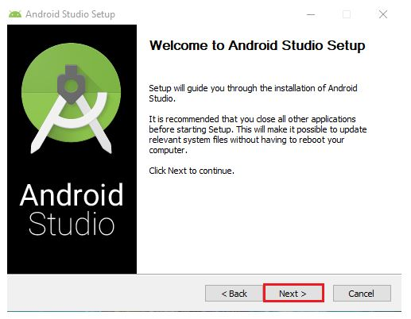

# 01 - Hello World

## Tujuan Pembelajaran

1. Mahasiswa mampu menginstall Android Studio, Android SDK, dan konfigurasi Kotlin
2. Mahasiswa Mampu menginstall Emulator
3. Mahasiswa Mampu Menghubungkan Mobile ke Komputer / Laptop
4. Mahasiswa mampu melaukan instalasi Git dan menkonfigurasikannya di Android Studio

## Hasil Praktikum

1. Mahasiswa mampu menginstall Android Studio, Android SDK, dan konfigurasi Kotlin

Jawab :

- Pertama, akan muncul halaman seperti pada gambar di bawah   ini. Klik Next untuk melanjutkan ke proses instalasi.

- Kemudian pilih komponen tambahan untuk install Android Studio. AVD (Android Virtual Device)

.PNG)

- Selanjutnya, pilih lokasi untuk install Android Studio pada komputer Anda.

.PNG)

- Proses Intalasi

.PNG)

- Klik Configure yang berada dibagian kanan bawah, lalu pilih SDK Manager, lebih jelasnya bisa dilihat pada gambar di bawah ini.

.PNG)

- Setelah memilih SDK Manager maka akan muncul jendela Default
Setting seperti gambar di bawah. Setelah itu pada bagian Appearance & Behavior (Bagian tab kri) silahkan pilih Android SDKkemudian klik teks kecil dibagian bawah yang bertuliskan “Launch Standalone SDK Manager”.

.PNG)

- Setelah memilih SDK yang ingin diinstal langsung saja klik Install Package.

.PNG)

- Setelah kalian Klik Install package maka akan muncul halaman seperi dibawah ini. Jika muncul halaman seperti dibawah ini maka ceklis pilihan Accept License pada bagian kanan bawah.

.PNG)

- Setelah selesai instalasi Package SDK Android maka kita telah siap untuk membuat project baru untuk membuat atau mengembangkan Aplikasi Android menggunakan Android Studio.

.PNG)

- Buka AVD Manager. Melalui Tools > Android > AVD Manager

.PNG)

- Ketika muncul panel berikut, klik Create Virtual Device.

.PNG)

- Halaman ini berfungsi untuk memilih ukuran layar. Android Studio sudah menyediakan ukuran yang banyak beredar di pasaran. Namun, kita juga bisa membuat profil sendiri melalui
tombol New Hardware Profile atau Import Hardware Profiles Lalu Next

.PNG)

- Selanjutnya adalah memilih system image Android. Mudahnya, kita di sini memilih versi android yang akan di install. Pilih sesuai kebutuhan. Lalu Next

.PNG)

- Pada panel ini, kita akan menentukan spesifikasi emulator. Untuk menampilkan semua pilihan, klik pada Show Advanced Settings. Advanced Settings menyajikan pilihan spesifikasi lebih detail. Jika sudah, finish

.PNG)

- AVD yang kita buat sudah muncul (Pixel 2 API 27).

.PNG)

- Jika sudah run aplikasi program kita dengan klik icon run dan memilih AVD yang akan digunakan

.PNG)

- Tunggu hingga proses selesai, Emulator kita akan muncul. Kita dapat menjalankan emulator seperti perangkat asli. Pada sebelah kanan, ada berbagai fungsi yang dapat kita gunakan.

.PNG)

3. Mahasiswa Mampu Menghubungkan Mobile ke Komputer / Laptop

- Pada perangkat Smartphone cari opsi pengembang, lalu aktifkan "debugging USB" dan "Install via USB"

.PNG)

- Kemudian pada Android Studio muncul nama perangkat smartphone anda di sebelah "run"

.PNG)

- Hasilnya pada smartphone

.PNG)
