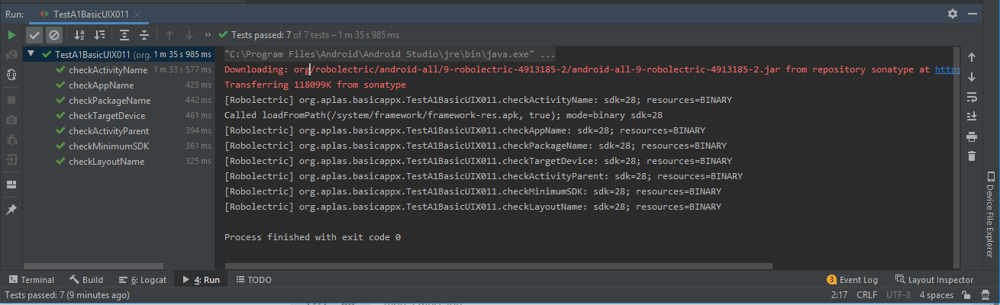
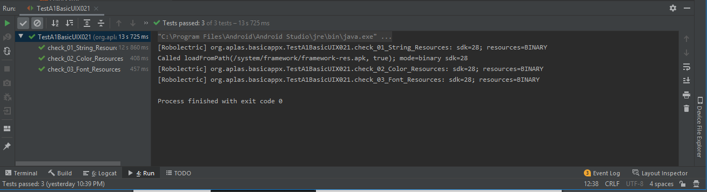
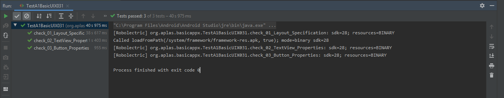
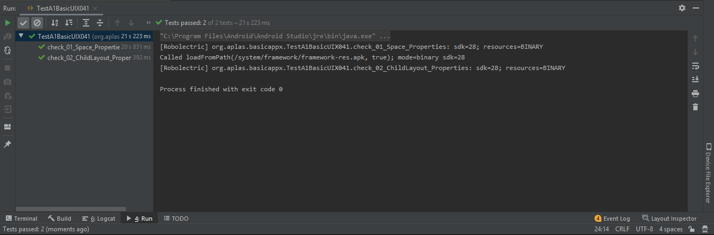
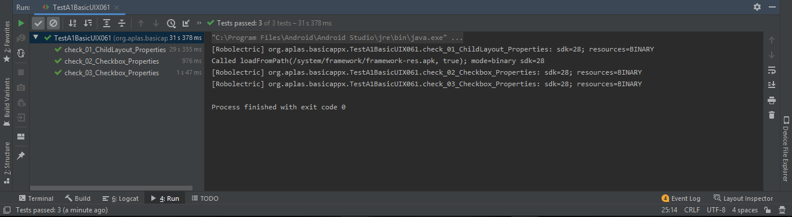
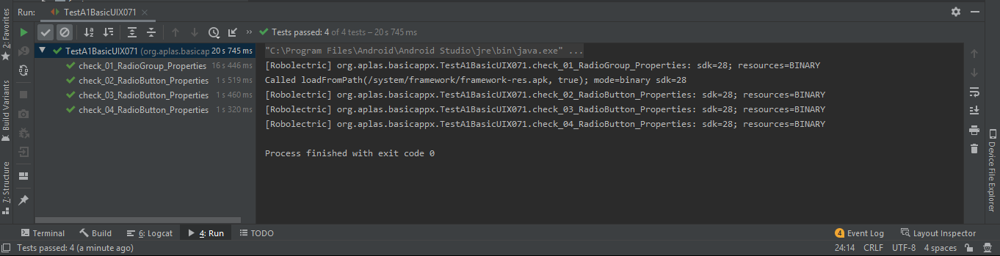

# 02 - Layout

## Tujuan Pembelajaran

1. Mahasiswa memahami konsep layout pada android.
2. Mahasiswa memahami konsep View Group dan Hierarchy pada layout.
3. Mahasiswa mampu membuat layout sederhana.
4. Mahasiswa menguasai layout editor dan kegunaannya pada android studio.

## Hasil Praktikum

1. TASK GUIDE (A1X.01) pada web APLAS (Project Configuration)

- Hasil dari TASK GUIDE (A1X.01) (Project Configuration)

2. TASK GUIDE (A1X.02) pada web APLAS (Resource configuration)

- Hasil dari TASK GUIDE (A1X.02) (Resource configuration)

3. TASK GUIDE (A1X.03) pada web APLAS (Main layout, textview, button)

- Hasil dari TASK GUIDE (A1X.03)

4. TASK GUIDE (A1X.04) pada web APLAS (Space and Child layout)

- Hasil dari TASK GUIDE (A1X.04)

5. TASK GUIDE (A1X.05) pada web APLAS (String-array, EditText, Spinner)

- Hasil dari TASK GUIDE (A1X.05)

.PNG)
.PNG)

6. TASK GUIDE (A1X.06) pada web APLAS (Checkbox)

- Hasil dari TASK GUIDE (A1X.06)

7. TASK GUIDE (A1X.07) pada web APLAS (RadioGroup)

- Hasil dari TASK GUIDE (A1X.07)

8. TASK GUIDE (A1X.08) pada web APLAS (Image resource and ImageView)

- Hasil dari TASK GUIDE (A1X.08)

.PNG)
.PNG)

9. TASK GUIDE (A1X.09) pada web APLAS (Drawable resource and Table layout)

- Hasil dari TASK GUIDE (A1X.09)

.PNG)
.PNG)