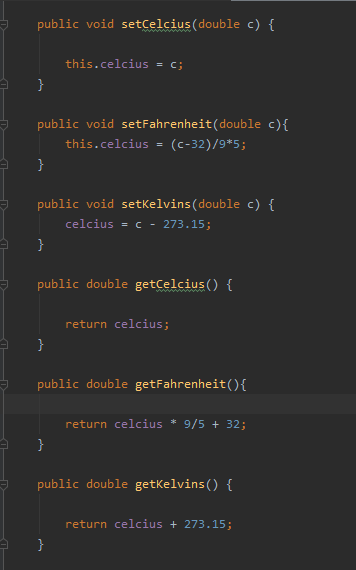
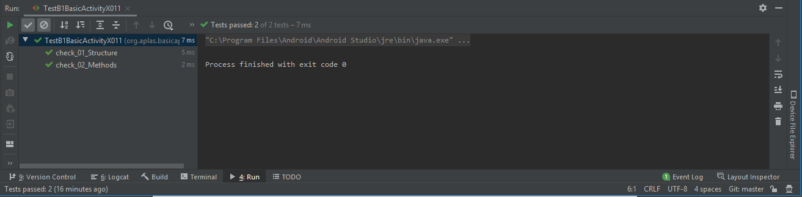
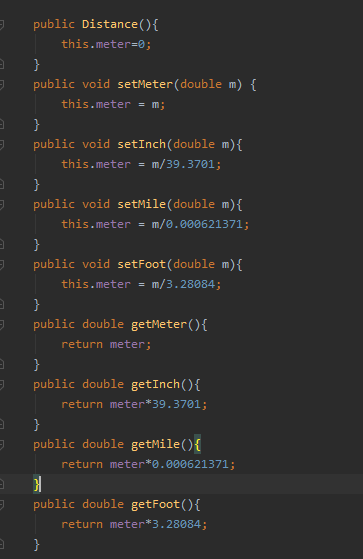
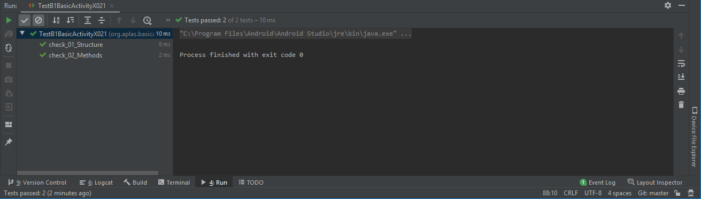
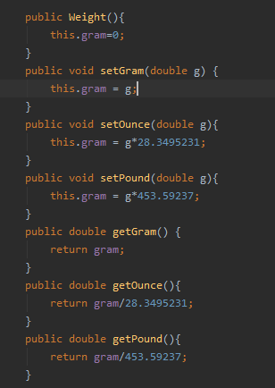
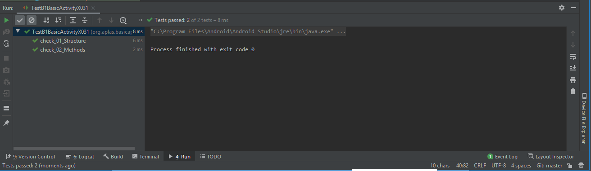

# 03 - Activity

## Tujuan Pembelajaran

1. Mahasiswa mampu melakukan pengujian, debugging, dan menggunakan pustaka dukungan.
2. Mahasisw mampu memodifikasi program kalkulator sederhana menjadi aplikasi yang layak digunakan.

## Hasil Praktikum

1. TASK GUIDE (B1X.01) pada web APLAS (Make Temperature Class)

- Task Description

Student start to write a class to convert between temperature units with specified requirement and test it.

- Make three set and get Method to assign “celcius” field refer on this formula:

- Make a “convert” method (function) to return a double value that convert from a unit (original) to another one (converted) as a return value. Utilize the get and set methods to create algorithm of this method.

.png)
.png)

- Hasil dari TASK GUIDE (B1X.01) (Make Temperature Class)

2. TASK GUIDE (B1X.02) pada web APLAS (Make Distance Class)

- Task Description

Student start to write a class to convert between distance units with specified requirement and test it.

- Make four set and get Method to assign “meter” field refer on this formula:

- Make a “convert” method (function) to return a double value that convert from a unit (original) to another one (converted) as a return value. Utilize the get and set methods to create algorithm of this method. 

.png)
.png)
.png)

- Hasil dari TASK GUIDE (B1X.02) (Make Distance Class)

3. TASK GUIDE (B1X.03) pada web APLAS (Make Weight Class)

- Task Description

Student start to write a class to convert between weight units with specified requirement and test it.

- Make three set and get Method to assign “gram” field refer on this formula:

- Make a “convert” method (function) to return a double value that convert from a unit (original) to another one (converted) as a return value. Utilize the get and set methods to create algorithm of this method.

.png)
.png)

- Hasil dari TASK GUIDE (B1X.03) (Make Weight Class)

4. TASK GUIDE (B1X.04) pada web APLAS (Define fields and methods in Activity)

- Task Description

Student start to define fields and methods in main activity class.

- Make some fields and Make 2 blank methods

    private Distance dist = new Distance();
    private Temperature temp = new Temperature();
    private Weight weight = new Weight();
    private Button convertBtn;
    private EditText inputTxt, outputTxt;
    private Spinner unitOri, unitConv;
    private RadioGroup unitType;
    private CheckBox roundBox, formBox;
    private ImageView imgView;
    private ImageView imgFormula;

    protected double convertUnit(String type, String oriUnit, String convUnit, double value){
        if (type.equals("Temperature")) {
            return temp.convert(oriUnit,convUnit,value);
        } else if (type.equals("Distance")) {
            return dist.convert(oriUnit,convUnit,value);
        }else {
            return weight.convert(oriUnit,convUnit,value);
        }
    }

    protected String strResult(double val, boolean rounded){
        DecimalFormat f = new DecimalFormat("#.##");
        DecimalFormat f2 = new DecimalFormat("#.#####");
        if(rounded==true){
            return f.format(val);
        }else {
            return f2.format(val);
        }
    }