# 03 - Basic Activity

## Tujuan Pembelajaran

1. Mahasiswa mampu melakukan pengujian, debugging, dan menggunakan pustaka dukungan.
2. Mahasisw mampu memodifikasi program kalkulator sederhana menjadi aplikasi yang layak digunakan.

## Hasil Praktikum

1. TASK GUIDE (B1X.01) pada web APLAS (Make Temperature Class)

- Task Description

Student start to write a class to convert between temperature units with specified requirement and test it.

- Make three set and get Method to assign “celcius” field refer on this formula:

public Temperature(){
        this.celcius = 0;
    }

    public void setCelcius(double c) {

        this.celcius = c;
    }

    public void setFahrenheit(double c){
        this.celcius = (c-32)/9*5;
    }

    public void setKelvins(double c) {
        celcius = c - 273.15;
    }

    public double getCelcius() {

        return celcius;
    }

    public double getFahrenheit(){

        return celcius * 9/5 + 32;
    }

    public double getKelvins() {

        return celcius + 273.15;
    }

- Make a “convert” method (function) to return a double value that convert from a unit (original) to another one (converted) as a return value. Utilize the get and set methods to create algorithm of this method.

        public double convert(String oriUnit, String convUnit, double value) {
        // C to C
        if (oriUnit.equals("°C") && convUnit.equals("°C")) {
            setCelcius(value);
            return getCelcius();
        }
        // C to F
        else if (oriUnit.equals("°C") && convUnit.equals("°F")) {
            setCelcius(value);
            return getFahrenheit();
        }
        // C to K
        else if (oriUnit.equals("°C") && convUnit.equals("K")) {
            setCelcius(value);
            return getKelvins();
        }
        // F to C
        else if (oriUnit.equals("°F") && convUnit.equals("°C")) {
            setFahrenheit(value);
            return getCelcius();
        }
        // F to F
        else if (oriUnit.equals("°F") && convUnit.equals("°F")) {
            setFahrenheit(value);
            return getFahrenheit();
        }
        // F to K
        else if (oriUnit.equals("°F") && convUnit.equals("K")) {
            setFahrenheit(value);
            return getKelvins();
        }
        // K to C
        else if (oriUnit.equals("K") && convUnit.equals("°C")) {
            setKelvins(value);
            return getCelcius();
        }
        // K to F
        else if (oriUnit.equals("K") && convUnit.equals("°F")) {
            setKelvins(value);
            return getFahrenheit();
        }
        // K to K
        else {
            setKelvins(value);
            return getKelvins();
        }

- Hasil dari TASK GUIDE (B1X.01) (Make Temperature Class)

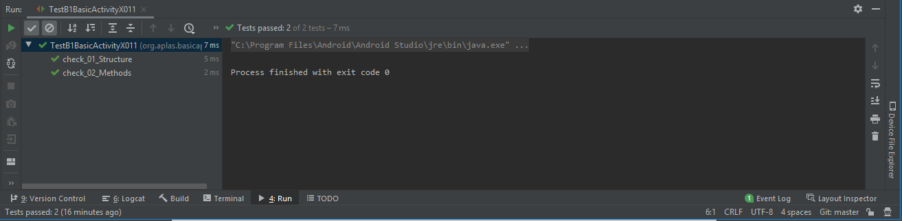

2. TASK GUIDE (B1X.02) pada web APLAS (Make Distance Class)

- Task Description

Student start to write a class to convert between distance units with specified requirement and test it.

- Make four set and get Method to assign “meter” field refer on this formula:

private double meter;

    public Distance(){
        this.meter=0;
    }
    public void setMeter(double m) {
        this.meter = m;
    }
    public void setInch(double m){
        this.meter = m/39.3701;
    }
    public void setMile(double m){
        this.meter = m/0.000621371;
    }
    public void setFoot(double m){
        this.meter = m/3.28084;
    }
    public double getMeter(){
        return meter;
    }
    public double getInch(){
        return meter*39.3701;
    }
    public double getMile(){
        return meter*0.000621371;
    }
    public double getFoot(){
        return meter*3.28084;
    }

- Make a “convert” method (function) to return a double value that convert from a unit (original) to another one (converted) as a return value. Utilize the get and set methods to create algorithm of this method. 

        public double convert(String oriUnit, String convUnit, double value){
        // Mtr to Mtr
        if (oriUnit.equals("Mtr") && convUnit.equals("Mtr")){
            setMeter(value);
            return getMeter();
        }
        // Mtr to Inc
        else if (oriUnit.equals("Mtr") && convUnit.equals("Inc")){
            setMeter(value);
            return getInch();
        }
        // Mtr to Mil
        else if (oriUnit.equals("Mtr") && convUnit.equals("Mil")){
            setMeter(value);
            return getMile();
        }
        // Mtr to Ft
        else if (oriUnit.equals("Mtr") && convUnit.equals("Ft")){
            setMeter(value);
            return getFoot();
        }
        // Inc to Mtr
        else if (oriUnit.equals("Inc") && convUnit.equals("Mtr")){
            setInch(value);
            return getMeter();
        }
        // Inc to Inch
        else if (oriUnit.equals("Inc") && convUnit.equals("Inc")){
            setInch(value);
            return getInch();
        }
        // Inc to Mil
        else if (oriUnit.equals("Inc") && convUnit.equals("Mil")){
            setInch(value);
            return getMile();
        }
        // Inc to Ft
        else if (oriUnit.equals("Inc") && convUnit.equals("Ft")){
            setInch(value);
            return getFoot();
        }
        // Mil to Mtr
        else if (oriUnit.equals("Mil") && convUnit.equals("Mtr")){
            setMile(value);
            return getMeter();
        }
        // Mil to Inc
        else if (oriUnit.equals("Mil") && convUnit.equals("Inc")){
            setMile(value);
            return getInch();
        }
        // Mil to Mil
        else if (oriUnit.equals("Mil") && convUnit.equals("Mil")){
            setMile(value);
            return getMile();
        }
        // Mil to Ft
        else if (oriUnit.equals("Mil") && convUnit.equals("Ft")){
            setMile(value);
            return getFoot();
        }
        // Ft to Mtr
        else if (oriUnit.equals("Ft") && convUnit.equals("Mtr")){
            setFoot(value);
            return getMeter();
        }
        // Ft to Inc
        else if (oriUnit.equals("Ft") && convUnit.equals("Inc")){
            setFoot(value);
            return getInch();
        }
        // Ft to Mil
        else if (oriUnit.equals("Ft") && convUnit.equals("Mil")){
            setFoot(value);
            return  getMile();
        }
        // Ft to Ft
        else{
            setFoot(value);
            return getFoot();
        }

- Hasil dari TASK GUIDE (B1X.02) (Make Distance Class)

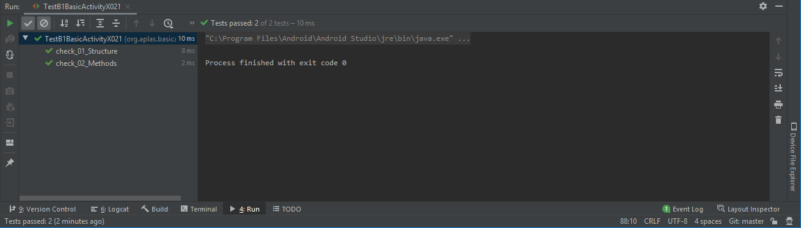

3. TASK GUIDE (B1X.03) pada web APLAS (Make Weight Class)

- Task Description

Student start to write a class to convert between weight units with specified requirement and test it.

- Make three set and get Method to assign “gram” field refer on this formula:

private double gram;

    public Weight(){
        this.gram=0;
    }
    public void setGram(double g) {
        this.gram = g;
    }
    public void setOunce(double g){
        this.gram = g*28.3495231;
    }
    public void setPound(double g){
        this.gram = g*453.59237;
    }
    public double getGram() {
        return gram;
    }
    public double getOunce(){
        return gram/28.3495231;
    }
    public double getPound(){
        return gram/453.59237;
    }

- Make a “convert” method (function) to return a double value that convert from a unit (original) to another one (converted) as a return value. Utilize the get and set methods to create algorithm of this method.

        public double convert(String oriUnit, String convUnit, double value){
        // Grm to Grm
        if (oriUnit.equals("Grm") && convUnit.equals("Grm")){
            setGram(value);
            return getGram();
        }
        // Grm to Onc
        else if (oriUnit.equals("Grm") && convUnit.equals("Onc")){
            setGram(value);
            return getOunce();
        }
        // Grm to Pnd
        else if (oriUnit.equals("Grm") && convUnit.equals("Pnd")){
            setGram(value);
            return getPound();
        }
        // Onc to Grm
        else if (oriUnit.equals("Onc") && convUnit.equals("Grm")){
            setOunce(value);
            return getGram();
        }
        // Onc to Onc
        else if (oriUnit.equals("Onc") && convUnit.equals("Onc")){
            setOunce(value);
            return getOunce();
        }
        // Onc to Pnd
        else if (oriUnit.equals("Onc") && convUnit.equals("Pnd")){
            setOunce(value);
            return getPound();
        }
        // Pnd to Grm
        else if (oriUnit.equals("Pnd") && convUnit.equals("Grm")){
            setPound(value);
            return getGram();
        }
        // Pnd to Onc
        else if (oriUnit.equals("Pnd") && convUnit.equals("Onc")){
            setPound(value);
            return getOunce();
        }
        // Pnd to Pnd
        else{
            setPound(value);
            return getPound();
        }

- Hasil dari TASK GUIDE (B1X.03) (Make Weight Class)

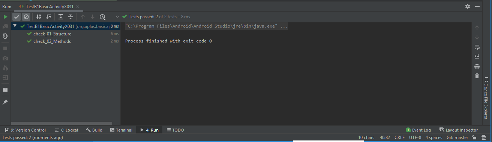

4. TASK GUIDE (B1X.04) pada web APLAS (Define fields and methods in Activity)

- Task Description

Student start to define fields and methods in main activity class.

- Make some fields and Make 2 blank methods

- Field Code

            private Distance dist = new Distance();
            private Temperature temp = new Temperature();
            private Weight weight = new Weight();
            private Button convertBtn;
            private EditText inputTxt, outputTxt;
            private Spinner unitOri, unitConv;
            private RadioGroup unitType;
            private CheckBox roundBox, formBox;
            private ImageView imgView;
            private ImageView imgFormula;

- Methods Code

        protected double convertUnit(String type, String oriUnit, String convUnit, double value){
        if (type.equals("Temperature")) {
            return temp.convert(oriUnit,convUnit,value);
        } else if (type.equals("Distance")) {
            return dist.convert(oriUnit,convUnit,value);
        }else {
            return weight.convert(oriUnit,convUnit,value);
        }
    }

        protected String strResult(double val, boolean rounded){
        DecimalFormat f = new DecimalFormat("#.##");
        DecimalFormat f2 = new DecimalFormat("#.#####");
        if(rounded==true){
            return f.format(val);
        }else {
            return f2.format(val);
        }
    }

- Hasil dari TASK GUIDE (B1X.04) (Define fields and methods in Activity)

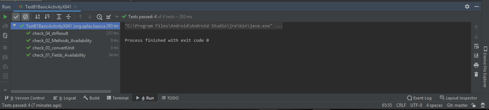

5. TASK GUIDE (B1X.05) pada web APLAS (Make Override method in Activity)

- Task Description

Student start to write methods to start activity and assign each element of activity.

- In “onCreate” method, write a code to load “activity_layout” located in layout resource Under syntax number 4, assign every field of layout elements that defined in task 2.01.04 with the resource in activity

        protected void onCreate(Bundle savedInstanceState) {
        super.onCreate(savedInstanceState);
        setContentView(R.layout.activity_main);
        convertBtn = (Button) findViewById(R.id.convertButton);
        inputTxt = (EditText) findViewById(R.id.inputText);
        outputTxt = (EditText) findViewById(R.id.outputText);
        unitOri = (Spinner) findViewById(R.id.oriList);
        unitConv = (Spinner) findViewById(R.id.convList);
        unitType = (RadioGroup) findViewById(R.id.radioGroup);
        roundBox = (CheckBox) findViewById(R.id.chkRounded);
        formBox = (CheckBox) findViewById(R.id.chkFormula);
        imgView = (ImageView) findViewById(R.id.img);

- Make a “onStart” method and define the dialog, then show the dialog

        protected void onStart(){
        super.onStart();
        startDialog = new AlertDialog.Builder(MainActivity.this).create();
        startDialog.setTitle("Application started");
        startDialog.setMessage("This app can use to convert any units");
        startDialog.setButton(AlertDialog.BUTTON_NEUTRAL, "OK",
                new DialogInterface.OnClickListener() {
                    @Override
                    public void onClick(DialogInterface dialog, int which) {
                        dialog.dismiss();
                    }
                });
        startDialog.show();
    }

- Hasil dari TASK GUIDE (B1X.05) (Make Override method in Activity)

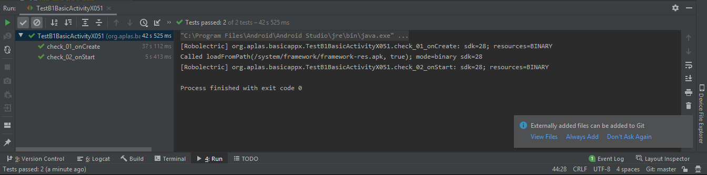

6. TASK GUIDE (B1X.06) pada web APLAS (Create RadioGroup event)

- Task Description

Student start to define string-array resource and make method in RadioGroup changed event to change Spinner content.

- Add the value of all “string-array” name 

        <string-array name="distList">
        <item>Mtr</item>
        <item>Inc</item>
        <item>Mil</item>
        <item>Ft</item>
        </string-array>
        <string-array name="weightList">
        <item>Grm</item>
        <item>Onc</item>
        <item>Pnd</item>
        </string-array>

- Create action listerner when radio button changed:

        public void onCheckedChanged(RadioGroup group, int checkedId) {
                        RadioButton checkedRadioButton = (RadioButton) findViewById(checkedId);
                        String checked = checkedRadioButton.getText().toString();
                        if (checked.equals("Distance")){
                            ArrayAdapter<CharSequence> arrayAdapter = ArrayAdapter.createFromResource(unitType.getContext(),
                                    R.array.distList, android.R.layout.simple_spinner_item);
                            imgView.setImageResource(R.drawable.distance);
                            arrayAdapter.setDropDownViewResource(android.R.layout.simple_spinner_dropdown_item);
                            unitOri.setAdapter(arrayAdapter);
                            unitConv.setAdapter(arrayAdapter);
                        }else if(checked.equals("Temperature")){
                            ArrayAdapter<CharSequence> arrayAdapter = ArrayAdapter.createFromResource(unitType.getContext(),
                                    R.array.tempList, android.R.layout.simple_spinner_item);
                            imgView.setImageResource(R.drawable.temperature);
                            arrayAdapter.setDropDownViewResource(android.R.layout.simple_spinner_dropdown_item);
                            unitOri.setAdapter(arrayAdapter);
                            unitConv.setAdapter(arrayAdapter);
                        }else if(checked.equals("Weight")){
                            ArrayAdapter<CharSequence> arrayAdapter = ArrayAdapter.createFromResource(unitType.getContext(),
                                    R.array.weightList, android.R.layout.simple_spinner_item);
                            imgView.setImageResource(R.drawable.weight);
                            arrayAdapter.setDropDownViewResource(android.R.layout.simple_spinner_dropdown_item);
                            unitOri.setAdapter(arrayAdapter);
                            unitConv.setAdapter(arrayAdapter);
                        }
                        inputTxt.setText("0");
                        outputTxt.setText("0");
                    }

- Hasil dari TASK GUIDE (B1X.06) (Create RadioGroup event)

.png)
.png)

7. TASK GUIDE (B1X.07) pada web APLAS (Make method to convert units)

- Task Description

Student start to write a method to do conversion in layout.

-  create a new void method with name “doConvert”

        public void doConvert(){
        RadioButton radioButton = (RadioButton) findViewById(unitType.getCheckedRadioButtonId());
        Spinner selectedOri = (Spinner) findViewById(R.id.oriList);
        String textOri = selectedOri.getSelectedItem().toString();
        Spinner selectedConv = (Spinner) findViewById(R.id.convList);
        String textConv = selectedConv.getSelectedItem().toString();

        double result = convertUnit(radioButton.getText().toString(), textOri, textConv, Double.parseDouble(String.valueOf(inputTxt.getText())));
        String resultText;

        if (roundBox.isChecked()){
            resultText = strResult(result,  true);
        }else{
            resultText = strResult(result, false);
        }
        outputTxt.setText(resultText);
    }

- Hasil dari TASK GUIDE (B1X.07) (Make method to convert units)

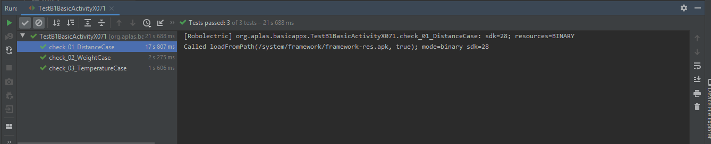

8. TASK GUIDE (B1X.08) pada web APLAS (Create Widget event listener)

- Task Description

Student start to write some methods to catch element action.

- Create an event listener to catch event when “convertButton” clicked

       convertBtn.setOnClickListener(new View.OnClickListener(){
            public void onClick(View v){
                doConvert();
            }
        });

- Create an event listener to catch event when “oriList” changed

        unitOri.setOnItemSelectedListener(new AdapterView.OnItemSelectedListener() {
            @Override
            public void onItemSelected(AdapterView<?> parent, View view, int position, long id) {
                doConvert();
            }

            @Override
            public void onNothingSelected(AdapterView<?> parent) {
                return;
            }
        });

- Create an event listener to catch event when “convList” changed

        unitConv.setOnItemSelectedListener(new AdapterView.OnItemSelectedListener() {
            @Override
            public void onItemSelected(AdapterView<?> parent, View view, int position, long id) {
                doConvert();
            }

            @Override
            public void onNothingSelected(AdapterView<?> parent) {
                return;
            }
        });

- Create an event listener to catch event when “roundBox” changed

        roundBox.setOnCheckedChangeListener(new CompoundButton.OnCheckedChangeListener() {
            @Override
            public void onCheckedChanged(CompoundButton buttonView, boolean isChecked) {
                doConvert();
            }
        });

Hasil dari TASK GUIDE (B1X.08) (Create Widget event listener)

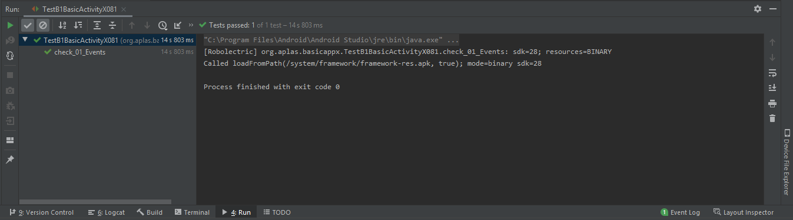

9. TASK GUIDE (B1X.09) pada web APLAS (Create ImageView and event)

- Task Description

Student start to upload a formula image and make an event listener when formula checkbox checked.

- Create an event listener to catch event when “roundBox” changed

        formBox.setOnCheckedChangeListener(new CompoundButton.OnCheckedChangeListener() {
            @Override
            public void onCheckedChanged(CompoundButton compoundButton, boolean isChecked) {
                if (formBox.isChecked()){
                    imgFormula.setVisibility(View.VISIBLE);
                }else{
                    imgFormula.setVisibility(View.INVISIBLE);
                }
            }
        });

Hasil dari TASK GUIDE (B1X.09) (Create ImageView and event)

.png)
.png)

10. Hasil Akhir

- Celcius to Fahrenheit
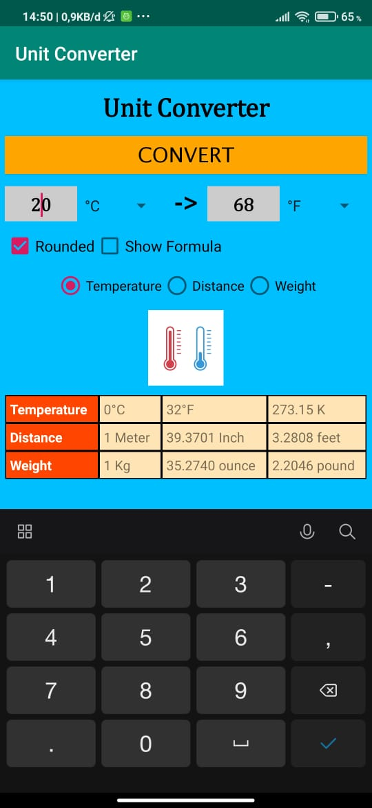

- Celcius to Kelvin

- Meter to Inch

- Meter to Milli

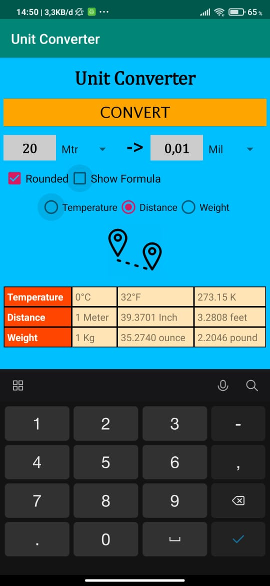

- Meter to Feet

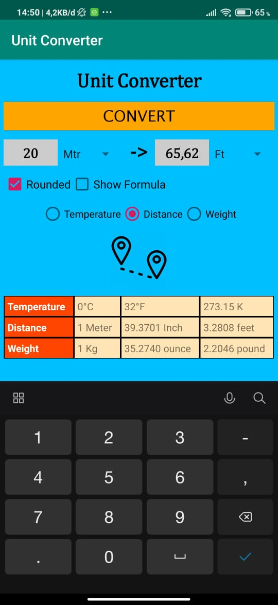

- Gram to Onch

- Gram to Pound

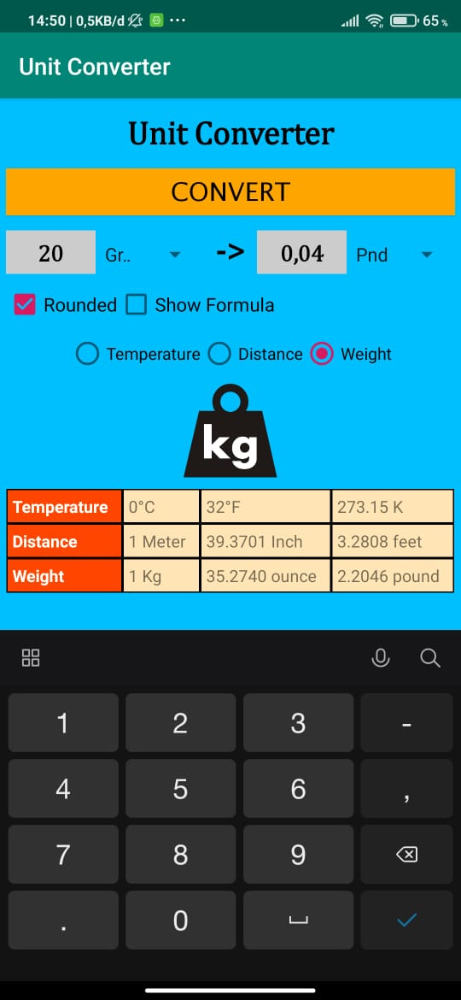

- Show Formula

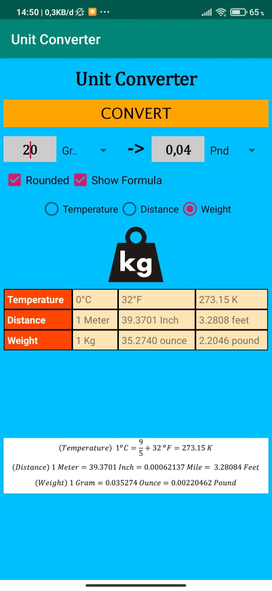