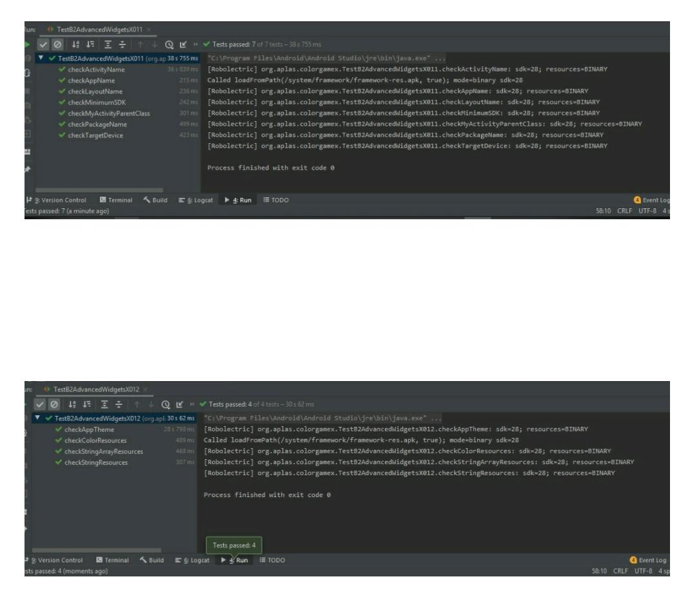
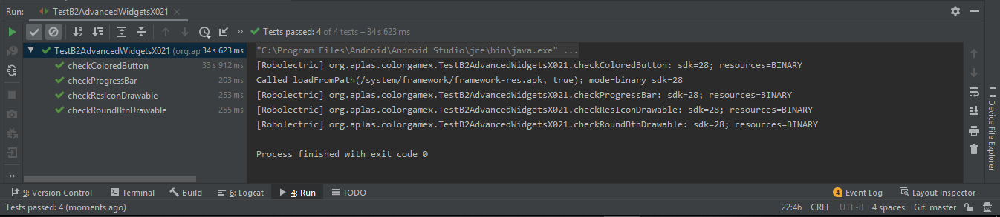
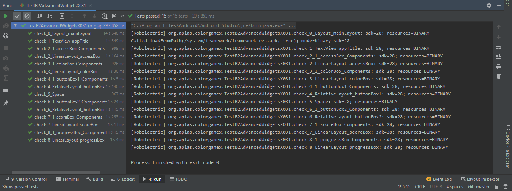
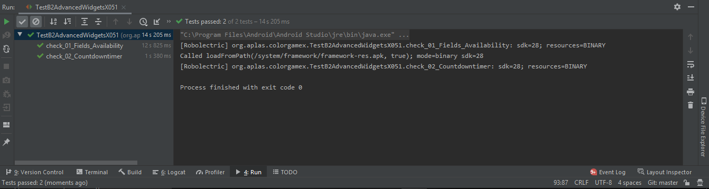
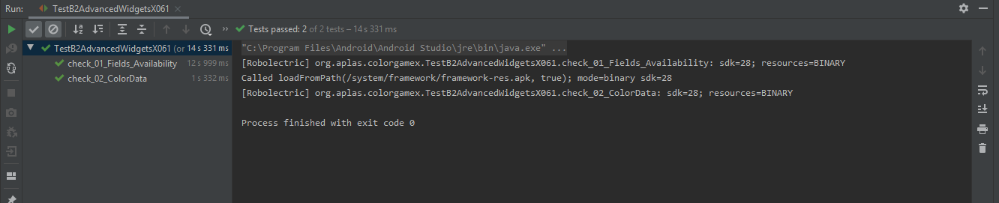
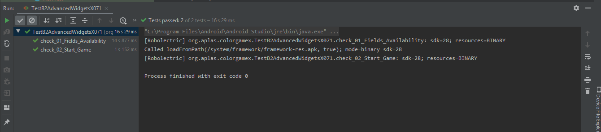
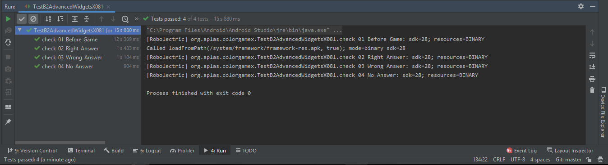

# 04 - 

## Tujuan Pembelajaran

1. Mahasiswa mampu memahami konsep penggunaan View Model pada aplikasi Android;
2. Mahasiswa mampu memahami konsep penggunaan Live Data pada aplikasi Android
3. Mahasiswa mampu menerapkan konsep ViewModel pada aplikasi Android
4. Mahasiswa mampu menerapkan konsep LiveData pada aplikasi Android

## Hasil Praktikum

1. TASK GUIDE (B2X.01) pada web APLAS (Define color, string, and integer resources)

- Task Description

Student start to create a project configuration and resource configuration.

- Open colors.xml add some colors 

        <?xml version="1.0" encoding="utf-8"?>
        <resources>
            <color name="greenLight">#96FD0A</color>
            <color name="textColor">#1B1B1B</color>
            <color name="titleBackground">#feffa7</color>
            <color name="textBackground">#E2E2E2</color>
            <color name="clrRed">#ff0000</color>
            <color name="clrYellow">#fff700</color>
            <color name="clrBlue">#001eff</color>
            <color name="clrGreen">#00ff15</color>
            <color name="clrOrange">#ff6f00</color>
            <color name="clrPurple">#9500ff</color>
        </resources>

- Open strings.xml. Add some strings and integers, add array string

        <resources>
            <integer name="minScore">0</integer>
            <integer name="maxScore">100</integer>
            <integer name="counter">10</integer>
            <integer name="mintimer">0</integer>
            <integer name="maxtimer">5</integer>
            <string name="keyword">quiz@123</string>
            <string name="app_name">APLAS COLOR GAME</string>

        <string-array name="colorList">
                <item>Red</item>
                <item>Yellow</item>
                <item>Blue</item>
                <item>Green</item>
                <item>Orange</item>
                <item>Purple</item>
            </string-array>
            <string-array name="charList">
                <item>A</item>
                <item>B</item>
                <item>C</item>
                <item>D</item>
                <item>E</item>
                <item>F</item>
            </string-array>

- Open styles.xml. Change the “AppTheme” configuration

        

- Hasil dari TASK GUIDE (B2X.01) (Define color, string, and integer resources)

2. TASK GUIDE (B2X.02) pada web APLAS (Define theme, style, and drawable resources)

- Task Description

Student start to upload drawable vector image and define new styles

- Open the file and define a shape in the “round_btn.xml” 

        <?xml version="1.0" encoding="utf-8"?>
        <shape xmlns:android="http://schemas.android.com/apk/res/android"
            android:shape="rectangle">

            <corners
                android:radius="20dp"
            />
            <gradient
                android:gradientRadius="100dp"
                android:centerX="50%"
                android:centerY="80%"
                android:centerColor="#9727a6"
                android:startColor="#a9b7d2"
                android:endColor="#7003a6"
                android:type="radial"
            />

            <size
                android:height="50dp"
                android:width="100dp"
                />
            <padding
                android:left="7dp"
                android:top="7dp"
                android:right="7dp"
                android:bottom="7dp"
            />

        </shape>

- Open “styles.xml” file. Under “AppTheme” tag, add new style with name “ColoredButton” Under “ColoredButton” tag, add new style with name “ProgressBar” with parent "@android:style/Widget.SeekBar 

        

            

- Hasil dari TASK GUIDE (B2X.02) (Define theme, style, and drawable resources)

3. TASK GUIDE (B2X.03) pada web APLAS (Completing the layout (UI))

- Task Description

Student start to create UI for color Game.

- On the layout xml editor, delete default “ConstraintLayout” with all its tag 

                <?xml version="1.0" encoding="utf-8"?>
        <LinearLayout xmlns:android="http://schemas.android.com/apk/res/android"
            xmlns:tools="http://schemas.android.com/tools"
            android:id="@+id/mainLayout"
            android:layout_width="match_parent"
            android:layout_height="match_parent"
            android:orientation="vertical"
            tools:context=".MyActivity">

            <TextView
                android:id="@+id/appTitle"
                android:textStyle="bold"
                android:layout_width="match_parent"
                android:layout_height="40dp"
                android:background="#feffa7"
                android:gravity="center"
                android:text="@string/app_name"
                android:textSize="12pt" />

            <LinearLayout
                android:id="@+id/accessBox"
                android:layout_width="wrap_content"
                android:layout_height="wrap_content"
                android:orientation="horizontal" >

                <EditText
                    android:id="@+id/appCode"
                    android:layout_width="200dp"
                    android:layout_height="30dp"
                    android:inputType="textPassword"
                    android:hint="Enter password here!"
                    android:background="#fafafa"/>
                <Button
                    android:id="@+id/submitBtn"
                    android:layout_width="wrap_content"
                    android:layout_height="30dp"
                    android:text="Enter"
                    android:onClick="openGame"
                    android:background="@android:color/darker_gray"/>

            </LinearLayout>

            <LinearLayout
                android:id="@+id/colorBox"
                android:layout_width="match_parent"
                android:layout_height="wrap_content"
                android:orientation="vertical"
                android:visibility="invisible">

                <TextView
                    android:id="@+id/clrText"
                    android:layout_width="150dp"
                    android:layout_height="55dp"
                    android:textSize="16pt"
                    android:textStyle="bold"
                    android:text=""
                    android:background="@color/textBackground"
                    android:gravity="center"
                    android:layout_gravity="center"
                    />

                <Space
                    android:id="@+id/spaceText1"
                    android:layout_width="match_parent"
                    android:layout_height="10dp"/>

                <TextView
                    android:id="@+id/appText1"
                    android:layout_width="wrap_content"
                    android:layout_height="30dp"
                    android:textSize="8pt"
                    android:textStyle="bold"
                    android:text="Select one of these colors according to text"
                    android:gravity="center"/>
            </LinearLayout>

            <RelativeLayout
                android:id="@+id/buttonBox1"
                android:layout_width="match_parent"
                android:layout_height="wrap_content"
                android:visibility="invisible" >

                <Button
                    android:id="@+id/color1"
                    style="@style/ColoredButton"
                    android:text="A"
                    android:background="@color/clrRed"
                    android:onClick="submitColor"
                    />
                <Button
                    android:id="@+id/color2"
                    style="@style/ColoredButton"
                    android:text="B"
                    android:background="@color/clrYellow"
                    android:onClick="submitColor"
                    android:layout_centerInParent="true"
                    />
                <Button
                    android:id="@+id/color3"
                    style="@style/ColoredButton"
                    android:text="C"
                    android:background="@color/clrBlue"
                    android:onClick="submitColor"
                    android:layout_alignParentEnd="true"
                    />
            </RelativeLayout>

            <Space
                android:id="@+id/spaceBox"
                android:layout_width="match_parent"
                android:layout_height="10dp" />

            <RelativeLayout
                android:id="@+id/buttonBox2"
                android:layout_width="match_parent"
                android:layout_height="wrap_content"
                android:visibility="invisible" >
                <Button
                    android:id="@+id/color4"
                    style="@style/ColoredButton"
                    android:text="D"
                    android:background="@color/clrGreen"
                    android:onClick="submitColor"
                    />
                <Button
                    android:id="@+id/color5"
                    style="@style/ColoredButton"
                    android:text="E"
                    android:background="@color/clrOrange"
                    android:onClick="submitColor"
                    android:layout_centerInParent="true"
                    />
                <Button
                    android:id="@+id/color6"
                    style="@style/ColoredButton"
                    android:text="F"
                    android:background="@color/clrPurple"
                    android:onClick="submitColor"
                    android:layout_alignParentEnd="true"
                    />
            </RelativeLayout>

            <LinearLayout
                android:id="@+id/scoreBox"
                android:layout_width="wrap_content"
                android:layout_height="wrap_content"
                android:layout_gravity="center"
                android:orientation="vertical"
                android:visibility="invisible">
                <TextView
                    android:id="@+id/timerText"
                    android:layout_width="wrap_content"
                    android:layout_height="40dp"
                    android:textStyle="bold"
                    android:text="timer"
                    android:fontFamily="serif-monospace"
                    android:textSize="14pt"
                    android:layout_marginTop="4dp"
                    android:gravity="center"
                    />
                <TextView
                    android:id="@+id/appText2"
                    android:layout_width="wrap_content"
                    android:layout_height="30dp"
                    android:textStyle="bold"
                    android:text="SCORE"
                    android:textSize="6pt"
                    android:gravity="center"/>
                <TextView
                    android:id="@+id/scoreText"
                    android:layout_width="120dp"
                    android:layout_height="55dp"
                    android:textStyle="bold"
                    android:text="0"
                    android:textSize="16pt"
                    android:gravity="center"
                    android:background="@color/textBackground"
                    android:textAlignment="center"
                    />
            </LinearLayout>

            <LinearLayout
                android:id="@+id/progressBox"
                android:layout_width="match_parent"
                android:layout_height="wrap_content"
                android:orientation="vertical"
                android:layout_gravity="center"
                android:visibility="invisible"
                >
                <Space
                    android:id="@+id/spaceBox2"
                    android:layout_width="match_parent"
                    android:layout_height="10dp"/>
                <ProgressBar
                    android:id="@+id/progressScore"
                    android:layout_width="match_parent"
                    android:layout_height="wrap_content"
                    style="@style/ProgressBar"
                    android:progress="@integer/minScore"
                    android:max="@integer/maxScore"/>
                <Switch
                    android:id="@+id/isMinus"
                    android:layout_width="wrap_content"
                    android:layout_height="wrap_content"
                    android:text="With minus score counter"
                    android:paddingBottom="20dp"/>
                <Button
                    android:id="@+id/startBtn"
                    android:layout_width="150dp"
                    android:layout_height="80dp"
                    android:textStyle="bold"
                    android:text="Start Game"
                    android:textSize="8pt"
                    android:layout_gravity="center"
                    android:background="@drawable/round_btn"
                    android:drawableBottom="@drawable/ic_resicon"
                    android:onClick="startGame"/>
            </LinearLayout>
        </LinearLayout>

- Hasil Dari TASK GUIDE (B2X.03) (Completing the layout (UI))

4. TASK GUIDE (B2X.04) pada web APLAS (Create validation method)

- Task Description

Student start to define fields and make method for validation

- Open “MyActivity.java” file, to start programming in activity. Declare some fields in MyActivity class.

        TextView timer;
        TextView clrText;
        TextView scoreText;
        EditText passwd;
        Button submit;
        Button start;
        ViewGroup accessbox;
        ViewGroup colorbox;
        ViewGroup buttonbox1;
        ViewGroup buttonbox2;
        ViewGroup scorebox;
        ViewGroup progressbox;
        ProgressBar progress;
        Switch isMinus;

        @Override
            protected void onCreate(Bundle savedInstanceState) {
                super.onCreate(savedInstanceState);
                setContentView(R.layout.activity_layout);
            }
        public void openGame(View v) {
        }
        public void startGame(View v){
        }
        public void submitGame(View v){
        }

- In the “onCreate” method, assign each declared field with related view resource

        timer = findViewById(R.id.timerText);
                clrText = findViewById(R.id.clrText);
                scoreText = findViewById(R.id.scoreText);
                passwd = findViewById(R.id.appCode);
                submit = findViewById(R.id.submitBtn);
                start = findViewById(R.id.startBtn);
                accessbox = findViewById(R.id.accessBox);
                colorbox = findViewById(R.id.colorBox);
                buttonbox1 = findViewById(R.id.buttonBox1);
                buttonbox2 = findViewById(R.id.buttonBox2);
                scorebox = findViewById(R.id.scoreBox);
                progressbox = findViewById(R.id.progressBox);
                progress = findViewById(R.id.progressScore);
                isMinus = findViewById(R.id.isMinus);

- In “openGame” method and make validation with compare String “keyword” (in string resource) with String from text in passwd (in EditText).

        public void openGame(View v) {
                String keyword = getString(R.string.keyword);
                String pass = passwd.getText().toString();
                if (keyword.equals(pass)) {
                    passwd.setVisibility(View.INVISIBLE);
                    submit.setVisibility(View.INVISIBLE);
                    accessbox.setVisibility(View.VISIBLE);
                    colorbox.setVisibility(View.VISIBLE);
                    buttonbox1.setVisibility(View.VISIBLE);
                    buttonbox2.setVisibility(View.VISIBLE);
                    scorebox.setVisibility(View.VISIBLE);
                    progressbox.setVisibility(View.VISIBLE);
                    Toast.makeText(getApplicationContext(), "Login Success", Toast.LENGTH_LONG).show();
                } else {
                    passwd.setVisibility(View.VISIBLE);
                    submit.setVisibility(View.VISIBLE);
                    accessbox.setVisibility(View.VISIBLE);
                    colorbox.setVisibility(View.INVISIBLE);
                    buttonbox1.setVisibility(View.INVISIBLE);
                    buttonbox2.setVisibility(View.INVISIBLE);
                    scorebox.setVisibility(View.INVISIBLE);
                    progressbox.setVisibility(View.INVISIBLE);
                    Toast.makeText(getApplicationContext(), "Password is wrong", Toast.LENGTH_LONG).show();
                }
            }

- Hasil TASK GUIDE (B2X.04) (Create validation method)

5. TASK GUIDE (B2X.05) pada web APLAS (Create method to start CountDownTimer)

- Task Description

Student start to declare Countdowntimer and utilize it to update timer

- Open “MyActivity.java” file and add new fields in MyActivity class

        CountDownTimer countDown;
        final String FORMAT = "%d:%d";

- Create a new private void method with name “initTime” and blank parameters. , define the countdown field with CountDownTimer definition

        private void initTimer() {
                countDown = new CountDownTimer(getResources().getInteger(R.integer.maxtimer) * 1000, 1) {
                    @Override
                    public void onTick(long millisUntilFinished) {
                        timer.setText("" + String.format(FORMAT, TimeUnit.MILLISECONDS.toSeconds(millisUntilFinished) - TimeUnit.MINUTES.toSeconds(TimeUnit.MILLISECONDS.toMinutes(millisUntilFinished)), TimeUnit.MILLISECONDS.toMillis(millisUntilFinished) - TimeUnit.SECONDS.toMillis(TimeUnit.MILLISECONDS.toSeconds(millisUntilFinished))));
                    }
- Hasil  TASK GUIDE (B2X.05) (Create method to start CountDownTimer)

6. TASK GUIDE (B2X.06) pada web APLAS (Create method to load color data to List and Hashtable)

- Task Description 
Student start to declare List and Hastable and load the array from resource to them.

- Create a new private void method with name “initColorList” and blank parameters.  assign “clrList” with color data from “colorList” resource with this code.

        private void initColorList() {

                clrList = getResources().getStringArray(R.array.colorList);
                String[] temp = getResources().getStringArray(R.array.charList);

                for (int i=0; i<clrList.length; i++) {
                    charList.put(clrList[i],temp[i]);
                }
            }

- Hasil dari TASK GUIDE (B2X.06) (Create method to load color data to List and Hashtable)

7. TASK GUIDE (B2X.07) pada web APLAS (Create method to start game)

- Task Description

Student start to declare method to start the game and start the timer

- Create a new function method with name “getNewRandomInt” with int output and 3 parameters. This method to get new random int between min and max, also with 1 number exception.

        int getNewRandomInt(int min, int max, int except) {
        Random r = new Random();
        boolean found = false;
        int number;
        do {
        number = r.ints(min, (max + 1)).findFirst().getAsInt();
        if (number!=except) found=true;
        } while (!found);
        return number;
        }

- Create a new private void method with name “newGameStage” and blank parameters.

        private void newGameStage() {
                String clrTxt = ((TextView) findViewById(R.id.clrText)).getText().toString();
                int lastNum = Arrays.asList(clrList).indexOf(clrTxt);
                int colorIdx = getNewRandomInt(0, 5, lastNum);
                clrText.setText(clrList[colorIdx]);
                countDown.start();
            }

- In “startGame” method, write this code

        public void startGame(View v) {
                if (!isStarted) {
                    progress.setProgress(0);
                    scoreText.setText("0");
                    start.setVisibility(View.INVISIBLE);
                    isStarted = true;
                    newGameStage();
                }
            }

- Hasil dari TASK GUIDE (B2X.07) (Create method to start game)

8. TASK GUIDE (B2X.08) (Create method to response user input and calculate score)

- Task Description

Student start to declare method to response correct and wrong answer then handle it with timer.

- Create a new private method with name “updateScore” with 1 int paramenter. 

        private void updateScore(int score) {
                progress.setProgress(score);
                scoreText.setText(Integer.toString(score));
            }

- Create a new private method with name “correctSubmit” with blank parameters. 

        private void correctSubmit() {
                int newScore = progress.getProgress()+getResources().getInteger(R.integer.counter);
                updateScore(newScore);
                if(progress.getProgress()==getResources().getInteger(R.integer.maxScore)){
                    countDown.cancel();
                    timer.setText("COMPLETE");
                    isStarted=false;
                    start.setVisibility(View.VISIBLE);
                }else{
                    newGameStage();
                }
            }

- Create a new private method with name “wrongSubmit” with blank parameters. 

        private void wrongSubmit() {
                if (isMinus.isChecked() && progress.getProgress()>0) {
                    updateScore(progress.getProgress()-getResources().getInteger(R.integer.counter));
                }
                newGameStage();
            }
- In “submitColor” method, if “isStarted” has true value

        public void submitColor(View v) {
                if(isStarted){
                    String charCode = ((Button)v).getText().toString();
                    if (charCode.equals(charList.get(clrText.getText().toString()))) {
                        correctSubmit();
                    } else {
                        wrongSubmit();
                    }
                }
            }

- Hasil dari TASK GUIDE (B2X.08) (Create method to response user input and calculate score)

