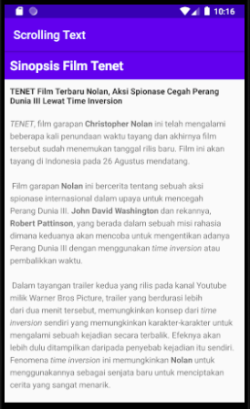
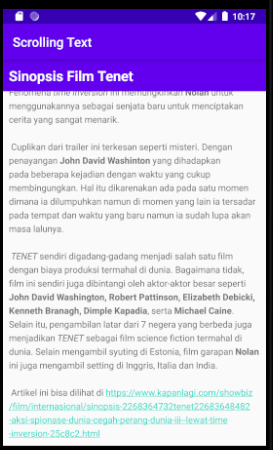
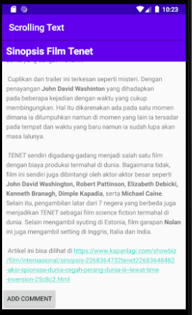
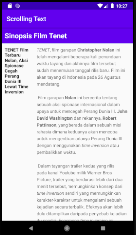
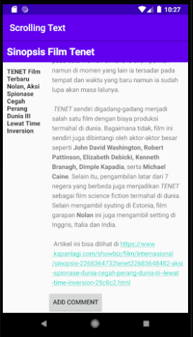

# 05 - Scrollview

## Tujuan Pembelajaran

1. How to use XML code to add multiple TextView elemets
2. How to use XML code to define a scrolling view
3. How to display free-form text with some HTML formatting tags
4. How to style the TextView background color and text color
5. How to include a web link in the text

## Hasil Praktikum

1. Task 1: Add and edit TextView elements

- Create TextView elements

        <TextView
                android:id="@+id/article_heading"
                android:layout_width="match_parent"
                android:layout_height="wrap_content"
                android:background="@color/colorPrimary"
                android:padding="@dimen/padding_regular"
                android:text="@string/article_tittle"
                android:textAppearance="@android:style/TextAppearance.DeviceDefault.Large"
                android:textColor="@android:color/white"
                android:textStyle="bold" />

        <TextView
                android:id="@+id/article_subheading"
                android:layout_width="100dp"
                android:layout_height="match_parent"
                android:padding="@dimen/padding_regular"
                android:text="@string/article_subtitle"
                android:textAppearance="@android:style/TextAppearance.DeviceDefault" />
        
        <TextView
                android:id="@+id/article"
                android:layout_width="wrap_content"
                android:layout_height="wrap_content"
                android:autoLink="web"
                android:lineSpacingExtra="@dimen/line_spacing"
                android:padding="@dimen/padding_regular"
                android:text="@string/article_text" />

- Add the text of the article

        <resources>
            <string name="app_name">Scrolling Text</string>
            <string name="article_tittle">Sinopsis Film Tenet</string>
            <string name="article_subtitle"><b>TENET Film Terbaru Nolan, Aksi Spionase Cegah Perang Dunia III Lewat Time Inversion</b></string>
            <string name="article_text"><i>TENET</i>, film garapan <b>Christopher Nolan</b> ini telah mengalami beberapa kali penundaan waktu tayang dan akhirnya film tersebut sudah menemukan tanggal rilis baru. Film ini akan tayang di Indonesia pada 26 Agustus mendatang.
            \n\n
                Film garapan <b>Nolan</b> ini bercerita tentang sebuah aksi spionase internasional dalam upaya untuk mencegah Perang Dunia III. <b>John David Washington</b> dan rekannya, <b>Robert Pattinson</b>, yang berada dalam sebuah misi rahasia dimana keduanya akan mencoba untuk mengentikan adanya Perang Dunia III dengan menggunakan <i>time inversion</i> atau pembalikkan waktu.
                \n\n
                Dalam tayangan trailer kedua yang rilis pada kanal Youtube milik Warner Bros Picture, trailer yang berdurasi lebih dari dua menit tersebut, memungkinkan konsep dari <i>time inversion</i> sendiri yang memungkinkan karakter-karakter untuk mengalami sebuah kejadian secara terbalik. Efeknya akan lebih dulu ditampilkan daripada penyebab kejadian itu sendiri. Fenomena <i>time inversion</i> ini memungkinkan <b>Nolan</b> untuk menggunakannya sebagai senjata baru untuk menciptakan cerita yang sangat menarik.
                \n\n
                Cuplikan dari trailer ini terkesan seperti misteri. Dengan penayangan <b>John David Washinton</b> yang dihadapkan pada beberapa kejadian dengan waktu yang cukup membingungkan. Hal itu dikarenakan ada pada satu momen dimana ia dilumpuhkan namun di momen yang lain ia tersadar pada tempat dan waktu yang baru namun ia sudah lupa akan masa lalunya.
                \n\n
                <i>TENET</i> sendiri digadang-gadang menjadi salah satu film dengan biaya produksi termahal di dunia. Bagaimana tidak, film ini sendiri juga dibintangi oleh aktor-aktor besar seperti <b>John David Washington, Robert Pattinson, Elizabeth Debicki, Kenneth Branagh, Dimple Kapadia</b>, serta <b>Michael Caine</b>. Selain itu, pengambilan latar dari 7 negera yang berbeda juga menjadikan <i>TENET</i> sebagai film science fiction termahal di dunia. Selain mengambil syuting di Estonia, film garapan <b>Nolan</b> ini juga mengambil setting di Inggris, Italia dan India.
                \n\n
                Artikel ini bisa dilihat di https://www.kapanlagi.com/showbiz/film/internasional/sinopsis-2268364732tenet22683648482-aksi-spionase-dunia-cegah-perang-dunia-iii--lewat-time-inversion-25c8c2.html
            </string>
            <string name="add_comment">ADD COMMENT</string>
        </resources>

2. Task 2: Add a ScrollView and an active web link

- Add the autoLink attribute for active web links

        <TextView
                android:layout_width="wrap_content"
                android:layout_height="wrap_content"
                android:id="@+id/article"
                android:autoLink="web"
                android:layout_below="@id/article_subheading"
                android:lineSpacingExtra="@dimen/line_spacing"
                android:padding="@dimen/padding_regular"
                android:text="@string/article_text" />

- Add a ScrollView to the layout

        <TextView
        android:layout_width="match_parent"
        android:layout_height="wrap_content"
        android:id="@+id/article_subheading"
        android:layout_below="@id/article_heading"
        android:padding="@dimen/padding_regular"
        android:text="@string/article_subtitle"
                android:textAppearance=
                            "@android:style/TextAppearance.DeviceDefault"/>

        <ScrollView
        android:layout_width="wrap_content"
        android:layout_height="wrap_content"></ScrollView>

        <TextView
                android:layout_width="wrap_content"
                android:layout_height="wrap_content"
                android:id="@+id/article"
                android:autoLink="web"
                android:layout_below="@id/article_subheading"
                android:lineSpacingExtra="@dimen/line_spacing"
                android:padding="@dimen/padding_regular"
                android:text="@string/article_text" />

3. Task 3: Scroll multiple elements

- Add a LinearLayout to the ScrollView

        <ScrollView
            android:layout_width="wrap_content"
            android:layout_height="wrap_content"
            android:layout_below="@id/article_subheading">
            
            <LinearLayout
                android:layout_width="match_parent"
                android:layout_height="wrap_content"></LinearLayout>
        <ScrollView
        android:layout_width="wrap_content"
        android:layout_height="wrap_content"
        android:layout_below="@id/article_subheading">

        <LinearLayout
            android:layout_width="match_parent"
            android:layout_height="wrap_content"
            android:orientation="vertical">

            <TextView
                android:id="@+id/article"
                android:layout_width="wrap_content"
                android:layout_height="wrap_content"
                android:autoLink="web"
                android:lineSpacingExtra="@dimen/line_spacing"
                android:padding="@dimen/padding_regular"
                android:text="@string/article_text" />
        </LinearLayout>

        </ScrollView>

- Move UI elements within the LinearLayout

        <ScrollView
                android:layout_width="wrap_content"
                android:layout_height="wrap_content"
                android:layout_below="@id/article_heading">

                <LinearLayout
                    android:layout_width="match_parent"
                    android:layout_height="wrap_content"
                    android:orientation="vertical">

                    <TextView
                        android:id="@+id/article_subheading"
                        android:layout_width="match_parent"
                        android:layout_height="wrap_content"
                        android:padding="@dimen/padding_regular"
                        android:text="@string/article_subtitle"
                        android:textAppearance=
                            "@android:style/TextAppearance.DeviceDefault" />

                    <TextView
                        android:id="@+id/article"
                        android:layout_width="wrap_content"
                        android:layout_height="wrap_content"
                        android:autoLink="web"
                        android:lineSpacingExtra="@dimen/line_spacing"
                        android:padding="@dimen/padding_regular"
                        android:text="@string/article_text" />
                </LinearLayout>

        </ScrollView>

- Hasil run app

4. Coding Challange

- Add button "Add Comment"

        <Button
                        android:id="@+id/button1"
                        android:layout_width="wrap_content"
                        android:layout_height="wrap_content"
                        android:text="@string/add_comment" />

- Hasil run app

5. Homework

- Change the subheading so that it wraps within a column on the left that is 100 dp wide, as shown below.

- Place the text of the article to the right of the subheading as shown below.

        <?xml version="1.0" encoding="utf-8"?>
        <RelativeLayout xmlns:android="http://schemas.android.com/apk/res/android"
            xmlns:tools="http://schemas.android.com/tools"
            android:layout_width="match_parent"
            android:layout_height="match_parent"
            android:orientation="vertical"
            android:layout_gravity="center_vertical"
            tools:context=".MainActivity">

            <TextView
                android:id="@+id/article_heading"
                android:layout_width="match_parent"
                android:layout_height="wrap_content"
                android:background="@color/colorPrimary"
                android:padding="@dimen/padding_regular"
                android:text="@string/article_tittle"
                android:textAppearance="@android:style/TextAppearance.DeviceDefault.Large"
                android:textColor="@android:color/white"
                android:textStyle="bold" />

            <LinearLayout
                android:layout_width="match_parent"
                android:layout_height="wrap_content"
                android:orientation="horizontal"
                android:layout_below="@id/article_heading">

                <TextView
                    android:id="@+id/article_subheading"
                    android:layout_width="100dp"
                    android:layout_height="match_parent"
                    android:padding="@dimen/padding_regular"
                    android:text="@string/article_subtitle"
                    android:textAppearance="@android:style/TextAppearance.DeviceDefault" />
                <ScrollView
                    android:layout_width="wrap_content"
                    android:layout_height="wrap_content">
                    <LinearLayout
                        android:layout_width="match_parent"
                        android:layout_height="wrap_content"
                        android:orientation="vertical">

                        <TextView
                            android:id="@+id/article"
                            android:layout_width="wrap_content"
                            android:layout_height="wrap_content"
                            android:autoLink="web"
                            android:lineSpacingExtra="@dimen/line_spacing"
                            android:padding="@dimen/padding_regular"
                            android:text="@string/article_text" />

                        <Button
                            android:id="@+id/button1"
                            android:layout_width="wrap_content"
                            android:layout_height="wrap_content"
                            android:text="@string/add_comment" />

                    </LinearLayout>
                </ScrollView>
            </LinearLayout>

        </RelativeLayout>

- Hasil run app

6. Answer Question

## Question 1
- How many views can you use within a ScrollView?

=   One view only

## Question 2
- Which XML attribute do you use in a LinearLayout to show views side by side?

=   android:orientation="horizontal"

## Question 3
- Which XML attribute do you use to define the width of the LinearLayout inside the scrolling view?

=   android:layout_width="match_parent"