# 08 - Multiactivites

## Tujuan Pembelajaran

1. Student will start an Android project to create an Android application that contains several activities entitled Soccer Match. First with project configuration and resource configuration.

## Hasil Praktikum

1. TASK GUIDE (B3.01)

- Task Description

Student start to create a project configuration and resource configuration.

- Configure the necessary string resource(s)

        <string name="app_name">Soccer Match</string>

- Change the content of “build.graddle (Module: app)” file like below, then Sync it

        apply plugin: 'com.android.application'
        android {
            compileSdkVersion 28
            buildToolsVersion "28.0.3"
            testOptions.unitTests.includeAndroidResources = true
            defaultConfig {
                applicationId "org.aplas.soccermatch"
                minSdkVersion 23
                targetSdkVersion 28
                versionCode 1
                versionName "1.0"
                testInstrumentationRunner "androidx.test.runner.AndroidJUnitRunner"
                buildConfigField "int", "MIN_SDK_VERSION", "$minSdkVersion.apiLevel"
                buildConfigField "int", "TARGET_SDK_VERSION", "$targetSdkVersion.apiLevel"
            }
            buildTypes {
                release {
                    minifyEnabled false
                    proguardFiles getDefaultProguardFile('proguard-android-optimize.txt'),
                            'proguard-rules.pro'
                }
            }
            compileOptions {
                sourceCompatibility JavaVersion.VERSION_1_8
                targetCompatibility JavaVersion.VERSION_1_8
            }
        }

        dependencies {
            implementation fileTree(dir: 'libs', include: ['*.jar'])
            implementation 'androidx.appcompat:appcompat:1.2.0'
            implementation 'androidx.recyclerview:recyclerview:1.1.0'
            implementation 'androidx.cardview:cardview:1.0.0'
            implementation 'androidx.legacy:legacy-support-v4:1.0.0'
            def fragment_version = "1.2.3"
            implementation 'com.google.android.material:material:1.2.1'
            implementation 'androidx.constraintlayout:constraintlayout:2.0.4'
            implementation "androidx.fragment:fragment:$fragment_version"
            testImplementation "org.robolectric:robolectric:4.2.1"
            debugImplementation "androidx.fragment:fragment-testing:$fragment_version"
            debugImplementation "androidx.fragment:fragment-testing:$fragment_version"
            testImplementation 'junit:junit:4.12'
            debugImplementation 'androidx.test:core:1.2.0'
            androidTestImplementation 'androidx.test.ext:junit:1.1.2'
            androidTestImplementation 'androidx.test.espresso:espresso-core:3.3.0'
        }

- Hasil Test

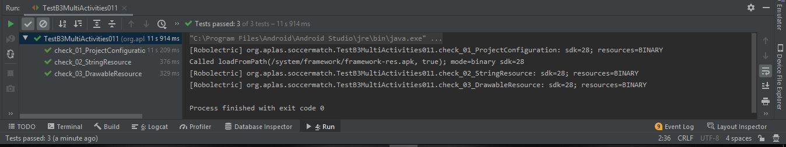

2. TASK GUIDE (B3.02)

- Task Description

Student start to create the first layout.

- Create a CardView to put title TextView with this code

        <androidx.cardview.widget.CardView
                android:id="@+id/mainTitleCard"
                android:layout_width="match_parent"
                android:layout_height="wrap_content"
                android:layout_margin="5dp"
                app:cardCornerRadius="7dp"
                app:cardElevation="6dp">
                <TextView
                    android:id="@+id/mainTitleTxt"
                    android:layout_width="match_parent"
                    android:layout_height="wrap_content"
                    android:background="@color/orange"
                    android:text="@string/app_title"
                    android:textAlignment="center"
                    android:textColor="@color/light_yellow"
                    android:textSize="18sp"
                    android:textStyle="bold" />

            </androidx.cardview.widget.CardView>

- Create a new CardView to put some widgets for Home Team data. You can setup your own CardView with your own Id, color, and other styling information.

        <androidx.cardview.widget.CardView
                android:id="@+id/home"
                android:layout_width="match_parent"
                android:layout_height="wrap_content"
                android:layout_margin="5dp"
                app:cardCornerRadius="7dp"
                app:cardElevation="6dp">

        <RelativeLayout
            android:layout_width="match_parent"
            android:layout_height="wrap_content">

            <TextView
                android:id="@+id/homeLabel"
                android:layout_width="match_parent"
                android:layout_height="wrap_content"
                android:background="@color/blue"
                android:text="@string/home_label"
                android:textAlignment="center"
                android:textColor="@color/light_yellow"
                android:textSize="16sp" />

            <LinearLayout
                android:layout_width="wrap_content"
                android:layout_height="wrap_content"
                android:layout_below="@id/homeLabel"
                android:background="@color/greyBlue"
                android:orientation="horizontal">

                <LinearLayout
                    android:layout_width="wrap_content"
                    android:layout_height="wrap_content"
                    android:orientation="vertical">

                    <EditText
                        android:id="@+id/homeTeam"
                        android:layout_width="wrap_content"
                        android:layout_height="wrap_content"
                        android:hint="Enter home team name"
                        android:inputType="text"
                        android:text="" />

                    <ImageButton
                        android:id="@+id/homeImage"
                        android:layout_width="wrap_content"
                        android:layout_height="wrap_content"
                        android:layout_gravity="center_horizontal"
                        android:adjustViewBounds="true"
                        android:background="@color/greyBlue"
                        android:contentDescription="UpdateLogo"
                        android:scaleType="fitCenter"
                        android:src="@drawable/teamlogo" />

                    <RelativeLayout
                        android:layout_width="match_parent"
                        android:layout_height="wrap_content"
                        android:orientation="horizontal">

                        <TextView
                            android:id="@+id/homePlayerNumber"
                            android:layout_width="wrap_content"
                            android:layout_height="wrap_content"
                            android:layout_margin="10dp"
                            android:text="0 player(s)"
                            android:textStyle="bold" />

                        <ImageButton
                            android:id="@+id/addHomePlayer"
                            android:layout_width="48dp"
                            android:layout_height="48dp"
                            android:layout_alignParentStart="false"
                            android:layout_alignParentEnd="true"
                            android:background="@color/greyBlue"
                            android:scaleType="fitEnd"
                            android:src="@drawable/icon_add_button" />
                    </RelativeLayout>
                </LinearLayout>

                <ListView
                    android:id="@+id/homePlayer"
                    android:layout_width="wrap_content"
                    android:layout_height="match_parent"
                    android:background="@color/steelBlue"
                    android:dividerHeight="1dp" />
            </LinearLayout>
        </RelativeLayout>
        </androidx.cardview.widget.CardView>

- Create a new CardView to put some widgets for Away Team data. You can setup your own CardView with your own Id, color, and other styling information. Inside this home Team CardView, put some these necessary widgets

        <androidx.cardview.widget.CardView
                android:id="@+id/away"
                android:layout_width="match_parent"
                android:layout_height="wrap_content"
                android:layout_margin="5dp"
                app:cardCornerRadius="7dp"
                app:cardElevation="6dp">

        <RelativeLayout
            android:layout_width="match_parent"
            android:layout_height="wrap_content">

            <TextView
                android:id="@+id/awayLabel"
                android:layout_width="match_parent"
                android:layout_height="wrap_content"
                android:background="@color/darkGreen"
                android:text="@string/awalLabel"
                android:textAlignment="center"
                android:textColor="@color/light_yellow"
                android:textSize="16sp" />

            <LinearLayout
                android:layout_width="wrap_content"
                android:layout_height="wrap_content"
                android:layout_below="@id/awayLabel"
                android:background="@color/seaGreen"
                android:orientation="horizontal">

                <LinearLayout
                    android:layout_width="wrap_content"
                    android:layout_height="wrap_content"
                    android:orientation="vertical">

                    <EditText
                        android:id="@+id/awayTeam"
                        android:layout_width="wrap_content"
                        android:layout_height="wrap_content"
                        android:hint="Enter away team name"
                        android:inputType="text"
                        android:text="" />

                    <ImageButton
                        android:id="@+id/awayImage"
                        android:layout_width="wrap_content"
                        android:layout_height="wrap_content"
                        android:layout_gravity="center_horizontal"
                        android:adjustViewBounds="true"
                        android:contentDescription="UpdateLogo"
                        android:background="@color/seaGreen"
                        android:scaleType="fitXY"
                        android:src="@drawable/teamlogo" />

                    <RelativeLayout
                        android:layout_width="match_parent"
                        android:layout_height="wrap_content"
                        android:orientation="horizontal">

                        <TextView
                            android:id="@+id/awayPlayerNumber"
                            android:layout_width="wrap_content"
                            android:layout_height="wrap_content"
                            android:layout_margin="10dp"
                            android:text="0 player(s)"
                            android:textStyle="bold" />

                        <ImageButton
                            android:id="@+id/addAwayPlayer"
                            android:layout_width="50dp"
                            android:layout_height="50dp"
                            android:layout_alignParentStart="false"
                            android:layout_alignParentEnd="true"
                            android:background="@color/seaGreen"
                            android:scaleType="fitCenter"
                            android:src="@drawable/icon_add_button" />
                    </RelativeLayout>
                </LinearLayout>

                <ListView
                    android:id="@+id/awayPlayer"
                    android:layout_width="206dp"
                    android:layout_height="match_parent"
                    android:background="@color/darkseaGreen"
                    android:dividerHeight="1dp" />
            </LinearLayout>
        </RelativeLayout>
        </androidx.cardview.widget.CardView>

- Add a Button at the bottom of layout with this specification:

        <Button
                        android:id="@+id/startBtn"
                        android:layout_width="wrap_content"
                        android:layout_height="wrap_content"
                        android:background="@color/deepPink"
                        android:padding="10dp"
                        android:text="Next" />

- Hasil Test
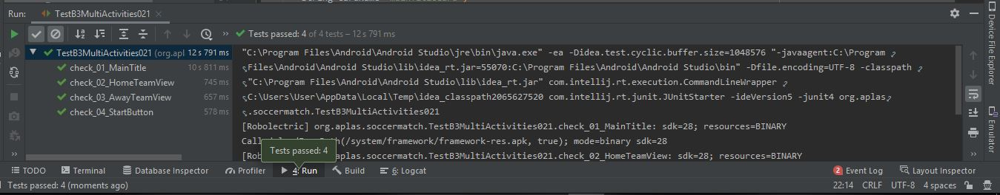

3. TASK GUIDE (B3.03)

- Task Description

Student start to create the second layout

- Create a CardView to put title TextView with this code.

        <androidx.cardview.widget.CardView
                android:id="@+id/playTitleCard"
                android:layout_width="match_parent"
                android:layout_height="wrap_content"
                android:layout_margin="5dp"
                app:cardCornerRadius="7dp"
                app:cardElevation="6dp">

                <TextView
                    android:id="@+id/playTitleTxt"
                    android:layout_width="match_parent"
                    android:layout_height="wrap_content"
                    android:background="@color/orange"
                    android:text="@string/play_title"
                    android:textAlignment="center"
                    android:textColor="@color/light_yellow"
                    android:textSize="18sp"
                    android:textStyle="bold" />
            </androidx.cardview.widget.CardView>

- Create a new CardView to put some widgets for Home Team data. You can setup your own CardView with your own Id, color, and other styling information.

        <TextView
                        android:id="@+id/homeTeam"
                        android:layout_width="match_parent"
                        android:layout_height="wrap_content"
                        android:background="@color/blue"
                        android:text="Home Team"
                        android:textAlignment="center"
                        android:textColor="@color/light_yellow"
                        android:textSize="16sp" />

                    <ImageView
                        android:id="@+id/homeLogo"
                        android:layout_width="100dp"
                        android:layout_height="100dp"
                        android:layout_gravity="center_horizontal"
                        android:layout_margin="5dp"
                        android:src="@drawable/teamlogo" />

                    <TextView
                        android:id="@+id/homeScore"
                        android:layout_width="100dp"
                        android:layout_height="100dp"
                        android:layout_gravity="center_horizontal"
                        android:layout_margin="5dp"
                        android:background="@android:color/white"
                        android:text="0"
                        android:textAlignment="center"
                        android:textColor="@android:color/black"
                        android:textSize="72sp"
                        android:textStyle="bold" />

                    <LinearLayout
                        android:layout_width="wrap_content"
                        android:layout_height="wrap_content"
                        android:orientation="horizontal">

                        <ImageButton
                            android:id="@+id/addHomeScore"
                            android:layout_width="48dp"
                            android:layout_height="48dp"
                            android:layout_margin="5dp"
                            android:adjustViewBounds="true"
                            android:scaleType="fitCenter"
                            android:src="@drawable/icon_goal" />

                        <ImageButton
                            android:id="@+id/addHomeYellow"
                            android:layout_width="48dp"
                            android:layout_height="48dp"
                            android:layout_margin="5dp"
                            android:adjustViewBounds="true"
                            android:scaleType="fitCenter"
                            android:src="@drawable/icon_yellow_card" />

                        <ImageButton
                            android:id="@+id/addHomeRed"
                            android:layout_width="48dp"
                            android:layout_height="48dp"
                            android:layout_margin="5dp"
                            android:adjustViewBounds="true"
                            android:scaleType="fitCenter"
                            android:src="@drawable/icon_red_card" />
                    </LinearLayout>

- Hasil Test

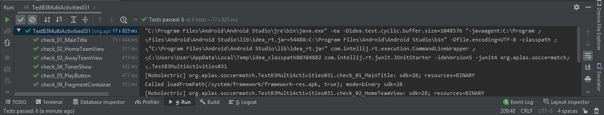

4. TASK GUIDE (B3.04)

- Task Description

Student start to create the third layout

- Create two new TextView at top of layout

        <TextView
                android:id="@+id/matchResultTxt"
                android:layout_width="match_parent"
                android:layout_height="wrap_content"
                android:layout_margin="5dp"
                android:gravity="center"
                android:textStyle="bold|italic"
                android:text="Home Team: 3"
                android:textColor="@android:color/black"
                android:textSize="24sp" />
            
            <TextView
                android:id="@+id/matchScoreTxt"
                android:layout_width="match_parent"
                android:layout_height="wrap_content"
                android:layout_margin="5dp"
                android:gravity="center"
                android:text="Away Team: 1"
                android:textColor="@android:color/black"
                android:textSize="24sp"
                android:textStyle="bold|italic" />

- Create a new RecyclerView to show the match log with Id: logRcView.

        <androidx.recyclerview.widget.RecyclerView
                android:id="@+id/logRcView"
                android:layout_width="match_parent"
                android:layout_height="wrap_content"
                android:scrollbars="vertical"
                style="@style/CardView.Light" />

- Hasil Test

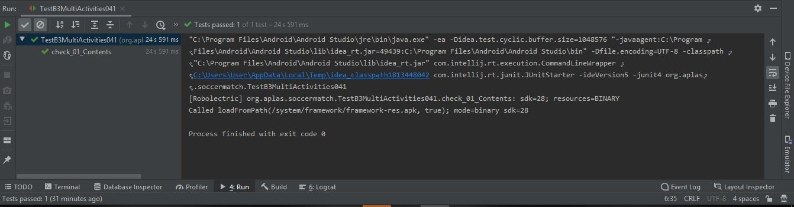

5. TASK GUIDE (B3.05)

- Task Description

Student start to create the third layout.

- Add a TextView in layout_list.xml

        <TextView
                android:id="@+id/listItem"
                android:layout_width="fill_parent"
                android:layout_height="wrap_content"
                android:padding="2dp"
                android:text=""/>

- Add an EditText in layout_dialog.xml

        <EditText
                android:id="@+id/playerName"
                android:layout_width="match_parent"
                android:layout_height="wrap_content"
                android:text=""
                android:textColor="@android:color/black" />

- In this CardView layout layout_log.xml

        <ImageView
                    android:id="@+id/eventIcon"
                    android:layout_width="wrap_content"
                    android:layout_height="wrap_content"
                    android:adjustViewBounds="true"
                    android:scaleType="fitCenter" />
        <TextView
                android:id="@+id/txtName"
                android:layout_width="match_parent"
                android:layout_height="wrap_content"
                android:layout_weight="1"
                android:text=""
                android:textColor="@android:color/black" />

            <TextView
                android:id="@+id/txtTime"
                android:layout_width="match_parent"
                android:layout_height="wrap_content"
                android:layout_weight="2"
                android:text=""
                android:textColor="@android:color/black" />
        <TextView
            android:id="@+id/txtPlayer"
            android:layout_width="match_parent"
            android:layout_height="wrap_content"
            android:layout_below="@+id/layoutNameTime"
            android:layout_marginTop="7dp"
            android:layout_toRightOf="@+id/eventIcon"
            android:text=""
            android:textColor="@android:color/black" />

- In this CardView layout fragment_footer.xml

        <ImageView
                        android:id="@+id/playImg"
                        android:layout_width="wrap_content"
                        android:layout_height="match_parent"
                        android:layout_margin="8dp"
                        android:src="@drawable/socceranim" />
        <TextView
                    android:paddingTop="10dp"
                    android:id="@+id/footerTxt"
                    android:layout_width="match_parent"
                    android:layout_height="wrap_content"
                    android:text="Soccer Last News:"
                    android:textSize="16sp" />

                <TextView
                    android:paddingTop="20dp"
                    android:id="@+id/newsTxt"
                    android:layout_width="match_parent"
                    android:layout_height="wrap_content"
                    android:text=""
                    android:textSize="16sp" />

- Hasil Test

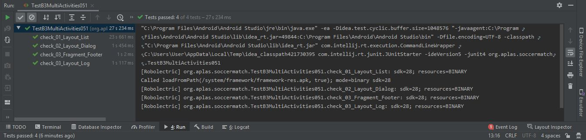

6. TASK GUIDE (B3.06)

- Task Description

Student start programming with MainActivity.

- Declare all variables that represents all widgets in activity_main.xml.

        private final int RESULT_HOME_IMG = 1;
        private final int RESULT_AWAY_IMG = 2;
        private final int EDITTEXT_ID = 900;
        private AlertDialog homeDialog, awayDialog;
        private ImageButton homeImage, awayImage, addHomePlayer, addAwayPlayer;
        private Button startBtn;
        private EditText homeTeam, awayTeam;
        private TextView homePlayerNumber, awayPlayerNumber;
        private ListView homePlayerList, awayPlayerList;
        private String homeImgPath = "";
        private String awayImgPath = "";
        private ArrayList<String> homePlayer = new ArrayList<>();
        private ArrayList<String> awayPlayer = new ArrayList<>();

- Then, to show a dialog to input player name, we must create a new method to activate a AlertDialog

        private AlertDialog getInputPlayerDialog(ArrayList<String> list, ListView listView, TextView playerNumber) {
                AlertDialog.Builder builder = new AlertDialog.Builder(new ContextThemeWrapper(this, R.style.AlertDialogCustom));
                builder.setMessage("Input Player Name:");
                LayoutInflater inflater = getLayoutInflater();
                View layout = inflater.inflate(R.layout.layout_dialog, null);
                builder.setView(layout);
                EditText playerName = (EditText) layout.findViewById(R.id.playerName);
                builder.setPositiveButton("OK", new DialogInterface.OnClickListener() {
                    @Override
                    public void onClick(DialogInterface dialog, int which) {
                        final String name = playerName.getText().toString();
                        list.add(name);
                        loadListView(list, listView);
                        playerNumber.setText(list.size() + " player(s)");
                        playerName.setText("");
                    }
                });
                builder.setNegativeButton("Cancel", null);
                return builder.create();
            }

- Hasil Test

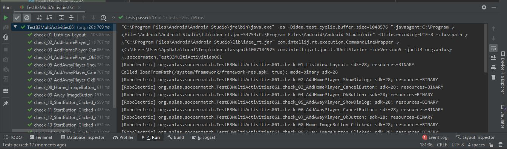

7. TASK GUIDE (B3.07)

- Task Description

Student start programming with PlayActivity.

- Declare all variables that represents all widgets in activity_play.xml.

        public class PlayActivity extends AppCompatActivity {

            final String separator = "@";
            long MillisecondTime, StartTime, TimeBuff, UpdateTime = 0L;
            int Hours, Seconds, Minutes;
            Handler handler;
            private ImageButton homeScoreBtn, homeYellowBtn, homeRedBtn, awayScoreBtn, awayYellowBtn, awayRedBtn;
            private Button startMatch, finishMatch;
            private ImageView homeLogo, awayLogo;
            private TextView timerTxt, homeTeamTxt, awayTeamTxt, homeScoreTxt, awayScoreTxt;
            public Runnable runnable = new Runnable() {
                public void run() {
                    MillisecondTime = SystemClock.uptimeMillis() - StartTime;
                    UpdateTime = TimeBuff + MillisecondTime;
                    Seconds = (int) (UpdateTime / 1000);
                    Hours = Seconds / 3600;
                    Seconds = Seconds % 3600;
                    Minutes = Seconds / 60;
                    Seconds = Seconds % 60;
                    timerTxt.setText("" + String.format("%02d", Hours) + ":" + String.format("%02d", Minutes) + ":" + String.format("%02d", Seconds));
                    handler.postDelayed(this, 0);
                }
            };
            private ArrayList<String> eventList = new ArrayList<>();
            private ArrayList<String> homePlayer, awayPlayer;

            @Override
            protected void onCreate(Bundle savedInstanceState) {
                super.onCreate(savedInstanceState);
                setContentView(R.layout.activity_play);

                homeScoreBtn = (ImageButton) findViewById(R.id.addHomeScore);
                awayScoreBtn = (ImageButton) findViewById(R.id.addAwayScore);
                homeYellowBtn = (ImageButton) findViewById(R.id.addHomeYellow);
                awayYellowBtn = (ImageButton) findViewById(R.id.addAwayYellow);
                homeRedBtn = (ImageButton) findViewById(R.id.addHomeRed);
                awayRedBtn = (ImageButton) findViewById(R.id.addAwayRed);
                startMatch = (Button) findViewById(R.id.matchStartBtn);
                finishMatch = (Button) findViewById(R.id.matchFinishBtn);
                homeLogo = (ImageView) findViewById(R.id.homeLogo);
                awayLogo = (ImageView) findViewById(R.id.awayLogo);
                timerTxt = (TextView) findViewById(R.id.timerShow);
                homeTeamTxt = (TextView) findViewById(R.id.homeTeam);
                awayTeamTxt = (TextView) findViewById(R.id.awayTeam);
                homeScoreTxt = (TextView) findViewById(R.id.homeScore);
                awayScoreTxt = (TextView) findViewById(R.id.awayScore);

                handler = new Handler();

                startMatch.setOnClickListener(new View.OnClickListener() {
                    @Override
                    public void onClick(View v) {
                        startBtnClick();
                    }
                });

                homeScoreBtn.setOnClickListener(new View.OnClickListener() {
                    @Override
                    public void onClick(View view) {
                        showPopupMenu(homePlayer, homeScoreBtn);
                    }
                });
                homeYellowBtn.setOnClickListener(new View.OnClickListener() {
                    @Override
                    public void onClick(View view) {
                        showPopupMenu(homePlayer, homeYellowBtn);
                    }
                });
                homeRedBtn.setOnClickListener(new View.OnClickListener() {
                    @Override
                    public void onClick(View view) {
                        showPopupMenu(homePlayer, homeRedBtn);
                    }
                });
                awayScoreBtn.setOnClickListener(new View.OnClickListener() {
                    @Override
                    public void onClick(View view) {
                        showPopupMenu(awayPlayer, awayScoreBtn);
                    }
                });
                awayYellowBtn.setOnClickListener(new View.OnClickListener() {
                    @Override
                    public void onClick(View view) {
                        showPopupMenu(awayPlayer, awayYellowBtn);
                    }
                });
                awayRedBtn.setOnClickListener(new View.OnClickListener() {
                    @Override
                    public void onClick(View view) {
                        showPopupMenu(awayPlayer, awayRedBtn);
                    }
                });

                finishMatch.setOnClickListener(new View.OnClickListener() {
                    @Override
                    public void onClick(View view) {
                        openLogActivity();
                    }
                });
            }

            private void loadTeamData() {
                Intent intent = getIntent();
                String homeTeam = intent.getStringExtra("HOME_TEAM_NAME");
                if (!homeTeam.isEmpty()) homeTeamTxt.setText(homeTeam);
                String awayTeam = intent.getStringExtra("AWAY_TEAM_NAME");
                if (!awayTeam.isEmpty()) awayTeamTxt.setText(awayTeam);
                homePlayer = intent.getStringArrayListExtra("HOME_TEAM_PLAYER");
                awayPlayer = intent.getStringArrayListExtra("AWAY_TEAM_PLAYER");
                try {
                    String homeImgPath = intent.getStringExtra("HOME_IMG_URI");
                    if (!homeImgPath.isEmpty()) {
                        Uri homeUri = Uri.parse(homeImgPath);
                        InputStream imageStream1 = getContentResolver().openInputStream(homeUri);
                        Bitmap selectedImage1 = BitmapFactory.decodeStream(imageStream1);
                        homeLogo.setImageBitmap(selectedImage1);
                    }
                    String awayImgPath = intent.getStringExtra("AWAY_IMG_URI");
                    if (!awayImgPath.isEmpty()) {
                        Uri awayUri = Uri.parse(awayImgPath);
                        InputStream imageStream2 = getContentResolver().openInputStream(awayUri);
                        Bitmap selectedImage2 = BitmapFactory.decodeStream(imageStream2);
                        awayLogo.setImageBitmap(selectedImage2);
                    }
                } catch (Exception e) {
                    Toast.makeText(PlayActivity.this, "Can't load image", Toast.LENGTH_LONG).show();
                }
            }

            private void showFooter() {
                FragmentManager fragmentManager = getSupportFragmentManager();
                FragmentTransaction fragmentTransaction = fragmentManager.beginTransaction();
                FooterFragment footer = new FooterFragment();
                fragmentTransaction.add(R.id.footer, footer, "footer");
                fragmentTransaction.commit();
            }

            @Override
            protected void onStart() {
                super.onStart();
                loadTeamData();
                showFooter();
            }

            private void setEventButtonClickable(boolean status) {
                homeScoreBtn.setEnabled(status);
                homeYellowBtn.setEnabled(status);
                homeRedBtn.setEnabled(status);
                awayScoreBtn.setEnabled(status);
                awayYellowBtn.setEnabled(status);
                awayRedBtn.setEnabled(status);
            }

            private void startBtnClick() {
                if (startMatch.getText().equals("Start")) {
                    StartTime = SystemClock.uptimeMillis();
                    handler.postDelayed(runnable, 1000);
                    startMatch.setText("Stop");
                    setEventButtonClickable(true);
                    finishMatch.setEnabled(false);
                } else if (startMatch.getText().equals("Stop")) {
                    TimeBuff += MillisecondTime;
                    handler.removeCallbacks(runnable);
                    startMatch.setText("Start");
                    setEventButtonClickable(false);
                    finishMatch.setEnabled(true);
                }
            }

            private void addEvent(String eventName, String playerName, String teamName, String currTime) {
                String data = eventName + separator + playerName + separator + teamName + separator + currTime;
                eventList.add(data);
                Fragment footerFragment = getSupportFragmentManager().findFragmentByTag("footer");
                View footerView = footerFragment.getView();
                TextView news = footerView.findViewById(R.id.newsTxt);
                String newsText = eventName + " for " + teamName + " by " + playerName + " at " + currTime;
                news.setText(newsText, TextView.BufferType.EDITABLE);
            }

            private void addScore(TextView scoreTxt) {
                int score = Integer.parseInt(scoreTxt.getText().toString()) + 1;
                scoreTxt.setText("" + score, TextView.BufferType.EDITABLE);
            }

            private void showPopupMenu(ArrayList<String> list, View anchor) {
                Context wrapper = new ContextThemeWrapper(getApplicationContext(), R.style.PopupMenu);
                PopupMenu popup = new PopupMenu(wrapper, anchor);
                for (int i = 0; i < list.size(); i++) {
                    popup.getMenu().add(list.get(i));
                }
                String currTime = timerTxt.getText().toString();
                popup.setOnMenuItemClickListener(new PopupMenu.OnMenuItemClickListener() {
                    public boolean onMenuItemClick(MenuItem item) {
                        switch (anchor.getId()) {
                            case R.id.addHomeScore: {
                                addEvent("Goal", item.getTitle().toString(), homeTeamTxt.getText().toString(), currTime);
                                addScore(homeScoreTxt);
                                break;
                            }
                            case R.id.addHomeYellow:
                                addEvent("Yellow Card", item.getTitle().toString(), homeTeamTxt.getText().toString(), currTime);
                                break;
                            case R.id.addHomeRed:
                                addEvent("Red Card", item.getTitle().toString(), homeTeamTxt.getText().toString(), currTime);
                                break;
                            case R.id.addAwayScore: {
                                addEvent("Goal", item.getTitle().toString(), awayTeamTxt.getText().toString(), currTime);
                                addScore(awayScoreTxt);
                                break;
                            }
                            case R.id.addAwayYellow:
                                addEvent("Yellow Card", item.getTitle().toString(), awayTeamTxt.getText().toString(), currTime);
                                break;
                            case R.id.addAwayRed:
                                addEvent("Red Card", item.getTitle().toString(), awayTeamTxt.getText().toString(), currTime);
                                break;
                            default:
                                break;
                        }
                        return true;
                    }
                });
                popup.show();
            }

            private void openLogActivity() {
                String matchResult, scoreResult;
                int homeScore = Integer.parseInt(homeScoreTxt.getText().toString());
                int awayScore = Integer.parseInt(awayScoreTxt.getText().toString());
                if (homeScore==awayScore) {
                    matchResult = "Draw";
                    scoreResult = homeScore+"-"+awayScore;
                } else if (homeScore>awayScore) {
                    matchResult = homeTeamTxt.getText().toString()+" Win!!";
                    scoreResult = homeScore+"-"+awayScore;
                } else {
                    matchResult = awayTeamTxt.getText().toString()+" Win!!";
                    scoreResult = awayScore+"-"+homeScore;
                }
                Intent log = new Intent(getApplicationContext(),LogActivity.class);
                log.putExtra("MATCH_RESULT", matchResult);
                log.putExtra("MATCH_SCORE", scoreResult);
                log.putStringArrayListExtra("MATCH_EVENT", eventList);
                startActivity(log);
            }

- Hasil Test

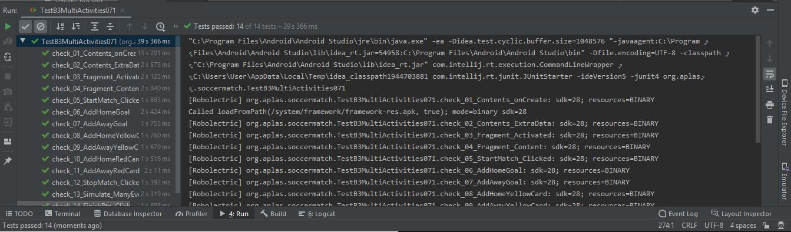

8. TASK GUIDE (B3.08)

- Task Description

Student start programming with LogActivity.

- Code LogAdapter.java

        public class LogAdapter extends RecyclerView.Adapter<LogAdapter.LogViewHolder> {

            private int listItemLayout;
            private ArrayList<LogItem> itemList;
            private Activity activity ;

            public LogAdapter(LogActivity logActivity, int layoutId, ArrayList<LogItem> itemList) {
                listItemLayout = layoutId;
                this.itemList = itemList;
                activity = (Activity) logActivity;
            }

            @Override
            public int getItemCount() {
                return itemList == null ? 0 : itemList.size();
            }

            @Override
            public LogAdapter.LogViewHolder onCreateViewHolder(ViewGroup parent, int viewType) {
                View view = LayoutInflater.from(parent.getContext()).inflate(listItemLayout, parent, false);
                LogViewHolder holder = new LogViewHolder(view);
                return holder;
            }

            @Override
            public void onBindViewHolder(final LogViewHolder holder,
                                        final int listPosition) {
                holder.time.setText(itemList.get(listPosition).getTime());
                holder.player.setText(itemList.get(listPosition).getPlayer());
                String name = itemList.get(listPosition).getName();
                holder.name.setText(name);
                if (name.startsWith("Goal")) {
                    holder.img.setImageResource(R.drawable.icon_goal);
                } else if (name.startsWith("Yellow")) {
                    holder.img.setImageResource(R.drawable.icon_yellow_card);
                } else {
                    holder.img.setImageResource(R.drawable.icon_red_card);
                }
            }

            public static class LogViewHolder extends RecyclerView.ViewHolder {
                public TextView name;
                public TextView time;
                public ImageView img;
                public TextView player;

                public LogViewHolder(View itemView) {
                    super(itemView);
                    name = (TextView) itemView.findViewById(R.id.txtName);
                    time = (TextView) itemView.findViewById(R.id.txtTime);
                    player = (TextView) itemView.findViewById(R.id.txtPlayer);
                    img = (ImageView) itemView.findViewById(R.id.eventIcon);
                }
            }

- Hasil Test

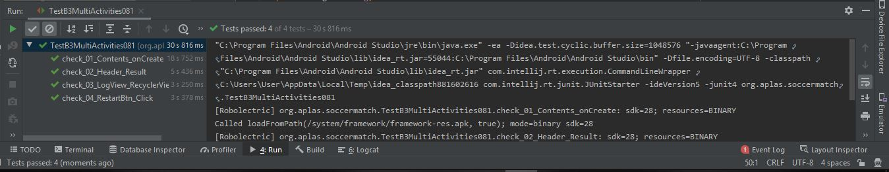

Hasil App

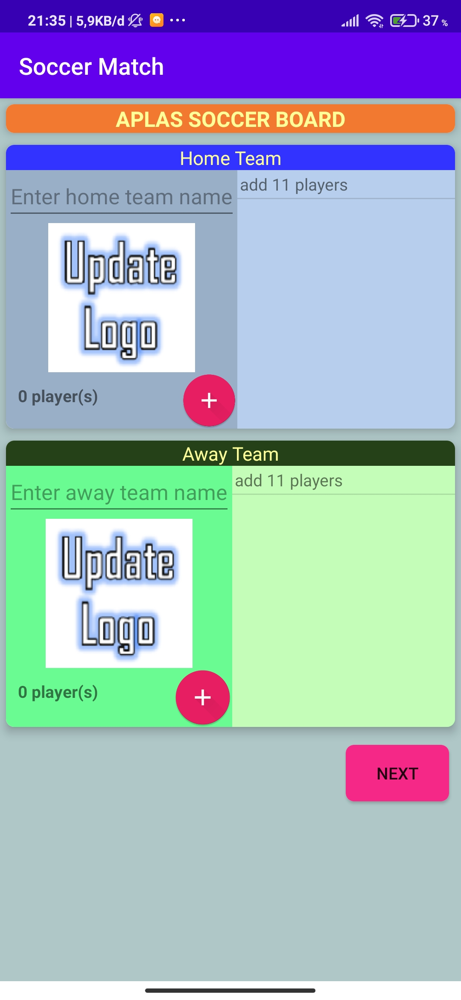
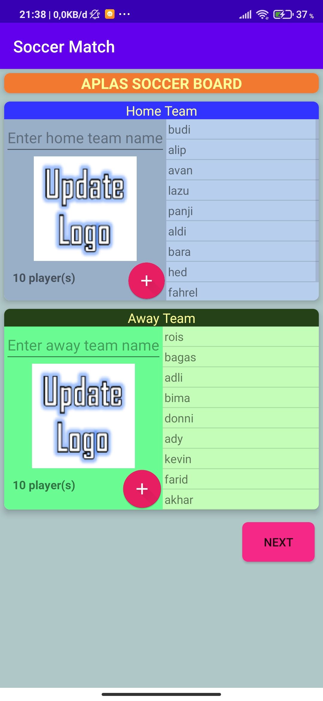
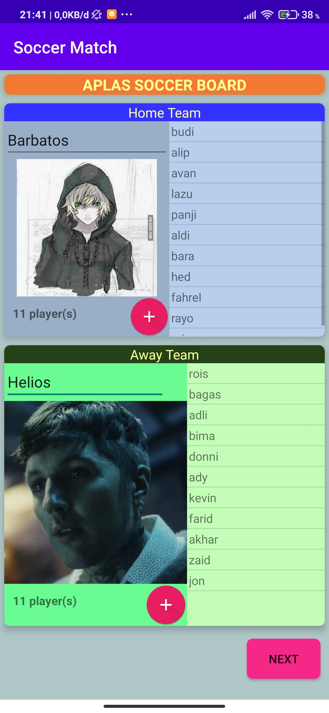

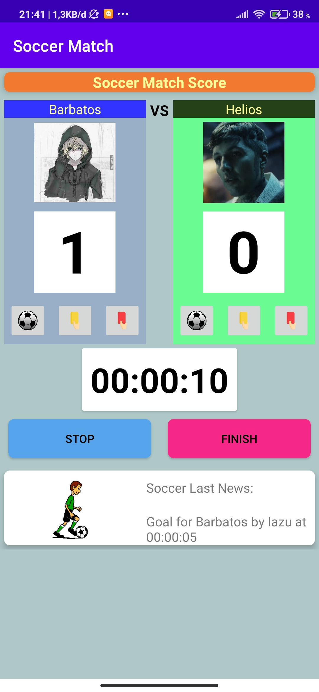
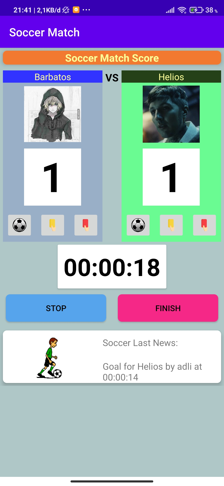

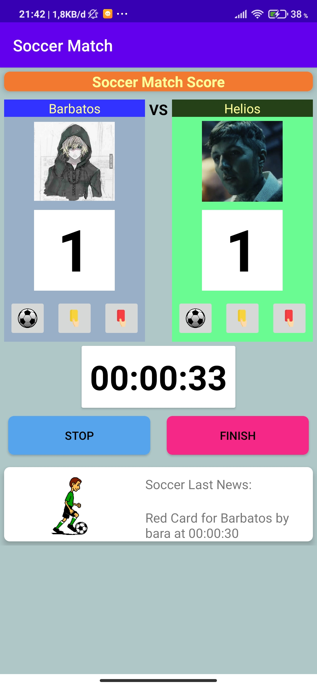

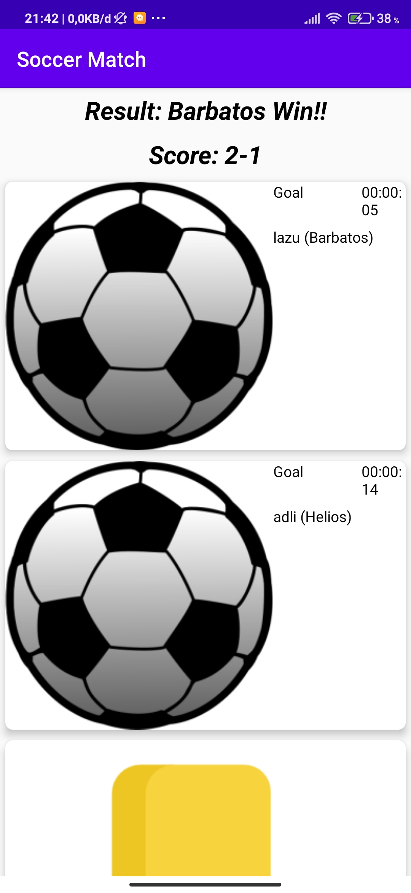