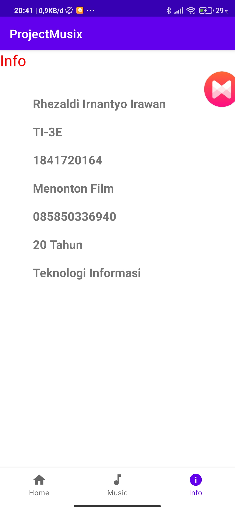
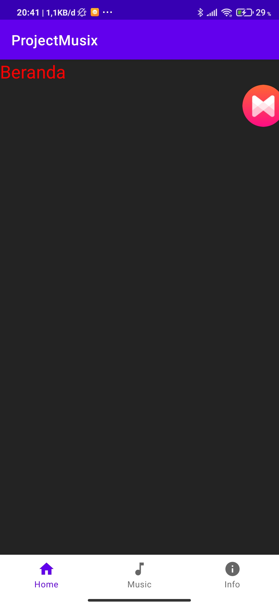
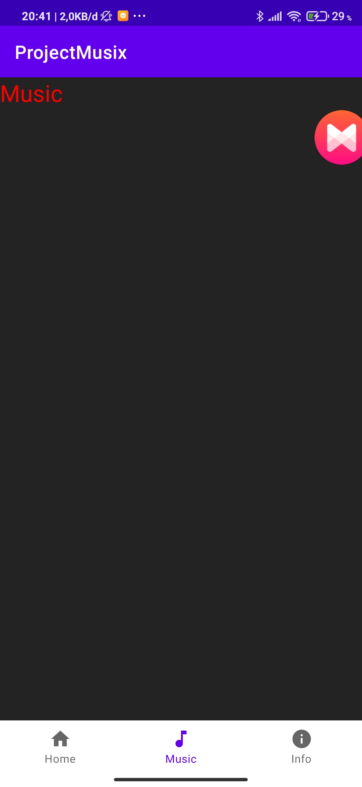

# 11 - Kuis 2

## Soal Kuis 2

1. Implementasikan materi/pertemuan sebelumnya tentang data binding, fragment, navigation, dan ViewModel pada ide project akhir Anda! (minimal 1 fitur tiap materi tersebut) Cantumkan tautan github Anda yang tertuju pada file markdown (.md) berisi screenshot tiap fitur tersebut.

2. Jelaskan perbedaan Data Binding dan ViewModel ? lalu pada saat kapan harus menggunakan Data Binding dan ViewModel ? (Mohon cantumkan referensinya).

3. Jelaskan perbedaan fragment dan Activity ? lalu pada saat kapan harus menggunakan fragment dan Activity ? (Mohon cantumkan referensinya).

## Jawab Kuis 2

1. Hasil data binding, fragment, navigation, dan viewmodel :

- data binding

Source code

build.gradle(app)

        buildFeatures {
                dataBinding true
            }

Info.java

        public class Info {
            public final String nama, kelas, nim, hobi,nomor, umur, jurusan;

            public Info(String nama, String kelas, String nim, String hobi, String nomor, String umur, String jurusan) {
                this.nama = nama;
                this.kelas = kelas;
                this.nim = nim;
                this.hobi = hobi;
                this.nomor = nomor;
                this.umur = umur;
                this.jurusan = jurusan;
            }
        }

InfoPage.java

        public View onCreateView(LayoutInflater inflater, ViewGroup container,
                                    Bundle savedInstanceState) {
                InfoBinding bindingInfo = DataBindingUtil.inflate(inflater, R.layout.info, container, false);
                Info info = new Info("Rhezaldi Irnantyo Irawan", "TI-3E", "1841720164", "Menonton Film", "085850336940", "20 Tahun","Teknologi Informasi");
                bindingInfo.setInfo(info);
                return bindingInfo.getRoot();
            }

Screenshot

- fragment

MainActivity.java

source code

        if(savedInstanceState == null){
                    getSupportFragmentManager().beginTransaction().replace(R.id.frameLayout, new HomePage()).commit();
                }
        @Override
                        public boolean onNavigationItemSelected(@NonNull MenuItem item) {
                            Fragment fragment = null;

                            switch (item.getItemId()){
                                case R.id.nav_home:
                                    fragment = new HomePage();
                                    break;
                                case R.id.nav_music:
                                    fragment = new MusicPage();
                                    break;
                                case R.id.nav_info:
                                    fragment = new InfoPage();
                                    break;
                            }

                            getSupportFragmentManager().beginTransaction().replace(R.id.frameLayout, fragment).commit();
                            return true;

                        }    

Screenshot

- navigation

source code

MainActivity.java

        protected void onCreate(Bundle savedInstanceState) {
                super.onCreate(savedInstanceState);
                setContentView(R.layout.activity_main);

                if(savedInstanceState == null){
                    getSupportFragmentManager().beginTransaction().replace(R.id.frameLayout, new HomePage()).commit();
                }

                BottomNavigationView bottomNavigationView = findViewById(R.id.neg_bar);
                bottomNavigationView.setOnNavigationItemSelectedListener(navigationItemSelectedListener);

            }

            private BottomNavigationView.OnNavigationItemSelectedListener navigationItemSelectedListener =
                    new BottomNavigationView.OnNavigationItemSelectedListener() {
                        @Override
                        public boolean onNavigationItemSelected(@NonNull MenuItem item) {
                            Fragment fragment = null;

                            switch (item.getItemId()){
                                case R.id.nav_home:
                                    fragment = new HomePage();
                                    break;
                                case R.id.nav_music:
                                    fragment = new MusicPage();
                                    break;
                                case R.id.nav_info:
                                    fragment = new InfoPage();
                                    break;
                            }

                            getSupportFragmentManager().beginTransaction().replace(R.id.frameLayout, fragment).commit();
                            return true;

                        }
                    };

navugationbottom.xml

        <?xml version="1.0" encoding="utf-8"?>
        <menu xmlns:android="http://schemas.android.com/apk/res/android">

            <item
                android:id="@+id/nav_home"
                android:icon="@drawable/ic_baseline_home_24"
                android:title="Home"/>
            <item
                android:id="@+id/nav_music"
                android:icon="@drawable/ic_baseline_music_note_24"
                android:title="Music"/>
            <item
                android:id="@+id/nav_info"
                android:icon="@drawable/ic_baseline_info_24"
                android:title="Info"/>
        </menu>

Screenshot

- Viewmodel

source code

info.xml

        <data>
                <variable
                    name="info"
                    type="org.aplas.projectmusix.Info" />
            </data>
        <TextView
                    android:layout_width="match_parent"
                    android:layout_height="wrap_content"
                    android:textSize="20sp"
                    android:textStyle="bold"
                    android:layout_marginTop="20dp"
                    android:text="@{info.nama}"/>

                <TextView
                    android:layout_width="match_parent"
                    android:layout_height="wrap_content"
                    android:textSize="20sp"
                    android:textStyle="bold"
                    android:layout_marginTop="20dp"
                    android:text="@{info.kelas}"/>

                <TextView
                    android:layout_width="match_parent"
                    android:layout_height="wrap_content"
                    android:textSize="20sp"
                    android:textStyle="bold"
                    android:layout_marginTop="20dp"
                    android:text="@{info.nim}"/>

                <TextView
                    android:layout_width="match_parent"
                    android:layout_height="wrap_content"
                    android:textSize="20sp"
                    android:textStyle="bold"
                    android:layout_marginTop="20dp"
                    android:text="@{info.hobi}"/>

                <TextView
                    android:layout_width="match_parent"
                    android:layout_height="wrap_content"
                    android:textSize="20sp"
                    android:textStyle="bold"
                    android:layout_marginTop="20dp"
                    android:text="@{info.nomor}"/>

                <TextView
                    android:layout_width="match_parent"
                    android:layout_height="wrap_content"
                    android:textSize="20sp"
                    android:textStyle="bold"
                    android:layout_marginTop="20dp"
                    android:text="@{info.umur}"/>

                <TextView
                    android:layout_width="match_parent"
                    android:layout_height="wrap_content"
                    android:textSize="20sp"
                    android:textStyle="bold"
                    android:layout_marginTop="20dp"
                    android:text="@{info.jurusan}"/>
            </LinearLayout>

InfoModel.java

        public class InfoModel extends ViewModel {

            private final ObservableField<String> nama = new ObservableField<>();
            private final ObservableField<String> kelas = new ObservableField<>();
            private final ObservableField<String> nim = new ObservableField<>();
            private final ObservableField<String> hobi = new ObservableField<>();
            private final ObservableField<String> nomor = new ObservableField<>();
            private final ObservableField<String> umur = new ObservableField<>();
            private final ObservableField<String> jurusan = new ObservableField<>();

            public void setModel(Info info){
                nama.set(info.nama);
                kelas.set(info.kelas);
                nim.set(info.nim);
                hobi.set(info.hobi);
                nomor.set(info.nomor);
                umur.set(info.umur);
                jurusan.set(info.jurusan);
            }
        }

InfoPage.java

        @Override
            public View onCreateView(LayoutInflater inflater, ViewGroup container,
                                    Bundle savedInstanceState) {
                InfoBinding bindingInfo = DataBindingUtil.inflate(inflater, R.layout.info, container, false);
                modelInfo = new ViewModelProvider(requireActivity()).get(InfoModel.class);
                Info info = new Info("Rhezaldi Irnantyo Irawan", "TI-3E", "1841720164", "Menonton Film", "085850336940", "20 Tahun","Teknologi Informasi");
                bindingInfo.setInfo(info);
                return bindingInfo.getRoot();
            }

Screenshot

nb : Viewmodel saya jadikan satu dengan Data Binding

2. Perbedaan Data Binding dan Viewmodel? kapan saat menggunakan Data Binding dan Viewmodel :

- Data Binding adalah support library yang memungkinkan Anda mengikat komponen UI dalam tata letak ke sumber data di aplikasi Anda menggunakan format deklaratif, bukan secara terprogram. (https://developer.android.com/topic/libraries/data-binding?hl=id)

- Komponen Arsitektur memberikan class pembantu ViewModel bagi pengontrol UI yang bertanggung jawab untuk menyediakan data bagi UI. Objek ViewModel secara otomatis disimpan pada saat perubahan konfigurasi sehingga data yang disimpan segera tersedia untuk instance aktivitas atau fragmen berikutnya. (https://developer.android.com/topic/libraries/architecture/viewmodel?hl=id) 

- Data Binding digunakan dalam aktivitas dengan kode yang memanggil metode framework UI, Viewmodel digunakan  untuk menyimpan dan mengelola data terkait UI dengan cara yang berbasis siklus proses.

3. Perbedaan fragment dan Activity? kapan saat menggunakan fragment dan Activity :

- Fragment adalah sebuah reuseable class yang mengimplement beberapa fitur sebuah Activity. (https://www.codepolitan.com/membuat-dan-menggunakan-fragment-59f80eff061a4)

- Activity adalah komponen yang dapat dilihat oleh pengguna, sehingga mereka dapat berinteraksi dengan aplikasi. (https://www.petanikode.com/android-activity/)

- Fragment biasanya dibuat sebagai bagian dari suatu antarmuka. Sebuah fragment harus berada di dalam sebuah activity, mereka tidak dapat berjalan sendiri tanpa adanya activity tempat mereka menempel. Activity memiliki siklus hidup (lifecycle) yang merupakan kondisi yang akan dialami saat diciptakan sampai dihancurkan.