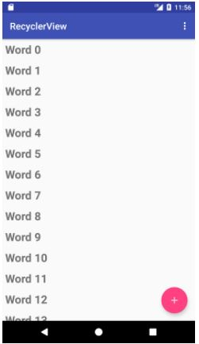
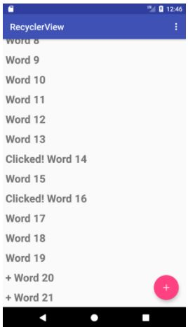

# 12 - Recycler View

## Tujuan Pembelajaran

1. How to use the RecyclerView class to display items in a scrollable list.
2. How to dynamically add items to the RecyclerView as they become visible through scrolling.
3. How to perform an action when the user taps a specific item.
4. How to show a FAB and perform an action when the user taps it.

## Hasil Praktikum

1. Create a new project and dataset

- Add code to create data

    a. Open MainActivity and add a private member variable for the mWordList linked list.

        public class MainActivity extends AppCompatActivity {
            private final LinkedList<String> mWordList = new LinkedList<>();
            // ... Rest of MainActivity code ...
        }
    
    b. Add code within the onCreate() method that populates mWordList with words:

        // Put initial data into the word list.
        for (int i = 0; i < 20; i++) {
                    mWordList.addLast("Word " + i);
        }

2. Create a RecyclerView

- Modify the layout in content_main.xml

    a. Open content_main.xml in your RecyclerView app, Replace the entire TextView element 

        <android.support.v7.widget.RecyclerView
                android:id="@+id/recyclerview"
                android:layout_width="match_parent"
                android:layout_height="match_parent">
        </android.support.v7.widget.RecyclerView>

- Create the layout for one list item

    a. Right-click the app > res > layout folder and choose New > Layout resource file.

    b. Name the file wordlist_item and click OK.

    c. Change the ConstraintLayout that was created with the file to a LinearLayout

        <LinearLayout
            xmlns:android="http://schemas.android.com/apk/res/android"
            xmlns:app="http://schemas.android.com/apk/res-auto"
            xmlns:tools="http://schemas.android.com/tools"
            android:layout_width="match_parent"
            android:layout_height="wrap_content"
            android:orientation="vertical"
            android:padding="6dp">
    
- Create an adapter

    a. Right-click java/com.android.example recyclerview and select New > Java Class.

    b. Name the class WordListAdapter.

    c. Give WordListAdapter extends

        public class WordListAdapter extends
            RecyclerView.Adapter<WordListAdapter.WordViewHolder>  {}
    
- Create the ViewHolder for the adapter

    a. Inside the WordListAdapter class, add a new WordViewHolder

        class WordViewHolder extends RecyclerView.ViewHolder {}
    
    b. Add variables to the WordViewHolder inner class for the TextView and the adapter

        public final TextView wordItemView;
        final WordListAdapter mAdapter;

    c. In the inner class WordViewHolder, add a constructor that initializes the ViewHolder TextView from the word XML resource, and sets its adapter

        public WordViewHolder(View itemView, WordListAdapter adapter) {
        super(itemView);
        wordItemView = itemView.findViewById(R.id.word);
        this.mAdapter = adapter;
        }
    
- Storing your data in the adapter

    a. To hold your data in the adapter, create a private linked list of strings in WordListAdapter and call it mWordList

        private final LinkedList<String> mWordList;
    
    b. You can now fill in the getItemCount() method to return the size of mWordList:

        @Override
        public int getItemCount() {
        return mWordList.size();
        }

    c. WordListAdapter needs a constructor that initializes the word list from the data. To create a View for a list item, the WordListAdapter needs to inflate the XML for a list item.

        private LayoutInflater mInflater;
    
    d. Implement the constructor for WordListAdapter. The constructor needs to have a context parameter, and a linked list of words with the app's data

        public WordListAdapter(Context context, 
                                    LinkedList<String> wordList) {
        mInflater = LayoutInflater.from(context);
        this.mWordList = wordList;
        }
    
    e. Fill out the onCreateViewHolder()

        @Override
        public WordViewHolder onCreateViewHolder(ViewGroup parent, int viewType) {
        View mItemView = mInflater.inflate(R.layout wordlist_item, parent, false);
        return new WordViewHolder(mItemView, this);
        }
    
    f. Fill out the onBindViewHolder()

        @Override
        public void onBindViewHolder(WordViewHolder holder, int position) {
        String mCurrent = mWordList.get(position);
        holder.wordItemView.setText(mCurrent);
        }

    g. Run app

3. Make the list interactive

- Make items respond to clicks

    a. Change the WordViewHolder class signature to implement View.onClickListener

        class WordViewHolder extends RecyclerView.ViewHolder implements View OnClickListener {
    
    b. Add the following code to the body of the onClick() method

        // Get the position of the item that was clicked.
        int mPosition = getLayoutPosition();
        // Use that to access the affected item in mWordList.
        String element = mWordList.get(mPosition);
        // Change the word in the mWordList.
        mWordList.set(mPosition, "Clicked! " + element);
        // Notify the adapter, that the data has changed so it can 
        // update the RecyclerView to display the data.
        mAdapter.notifyDataSetChanged();

    c. Connect the onClickListener with the View. Add this code to the WordViewHolder constructor (below the this.mAdapter = adapter line

        itemView.setOnClickListener(this);

- Add behavior to the FAB

    a. Open MainActivity. The onCreate() method sets an OnClickListener() to the FloatingActionButton with an onClick() method for taking an action. 

        @Override
        public void onClick(View view) {
            int wordListSize = mWordList.size();
            // Add a new word to the wordList.
            mWordList.addLast("+ Word " + wordListSize);
            // Notify the adapter, that the data has changed.
            mRecyclerView.getAdapter().notifyItemInserted(wordListSize);
            // Scroll to the bottom.
            mRecyclerView.smoothScrollToPosition(wordListSize);
        }
    
    b. Run app

4. Coding Challenges

- Challenge 1: Change the options menu to show only one option: Reset. This option should return the list of words to its original state, with nothing clicked and no extra words.

.JPG)

5. Homework

