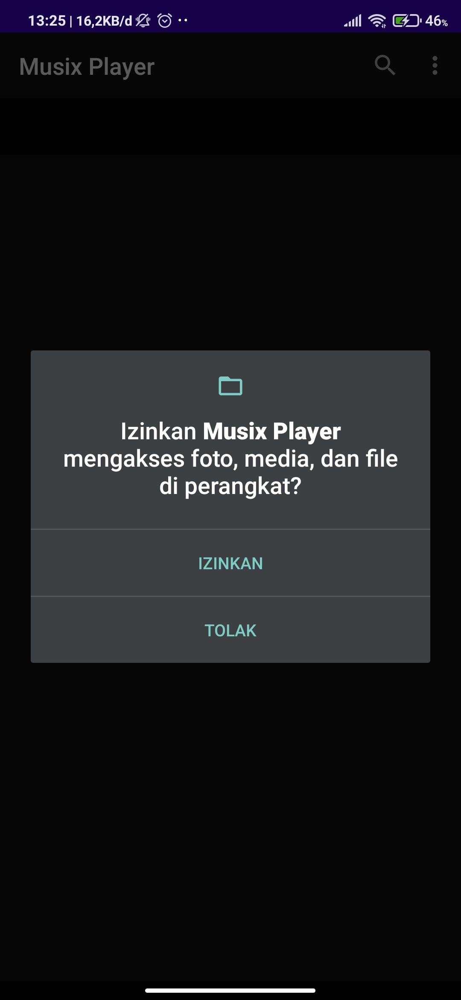
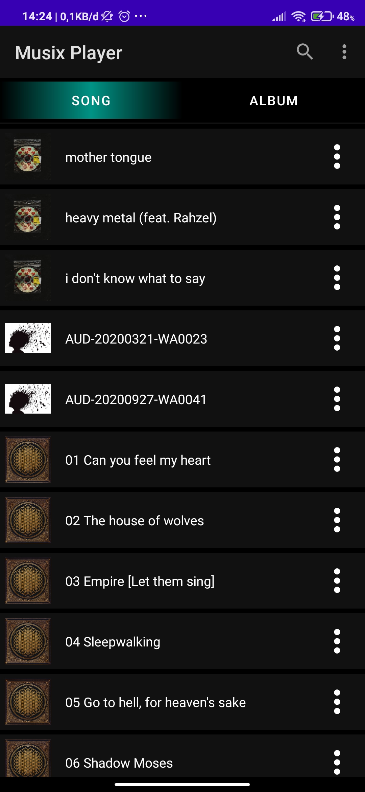
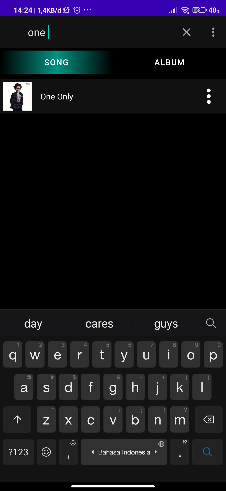
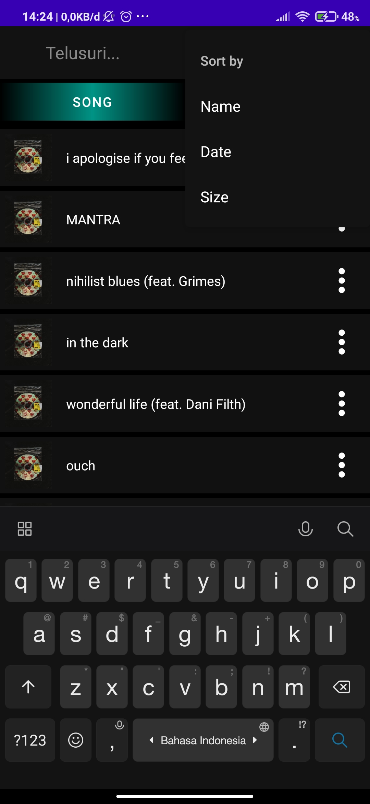
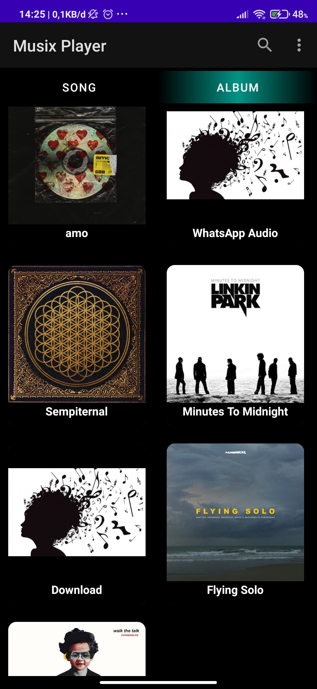
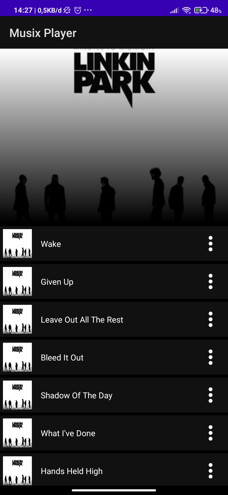
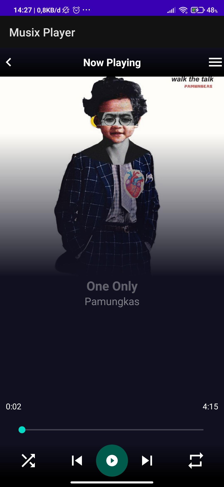
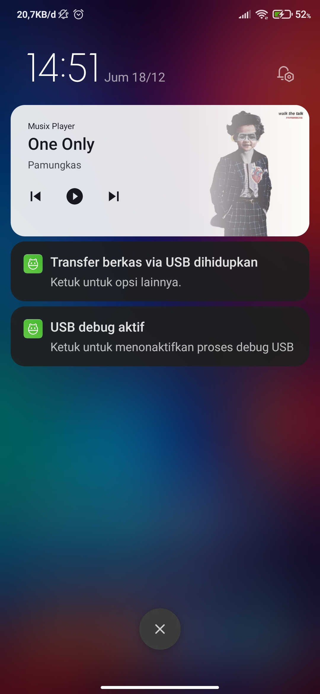

# 14 - UAS

## Musix Player

- Link Source Code aplikasi yang pada github :

https://github.com/Aldirhezaldi/mobile-3e-24/tree/master/src/14_uas/MusixPlayer

- Disini saya menggunakan Bahasa Pemrograman Java, pada Android Studio sendiri ada namanya Android SDK yang mengandung banyak library Java standar (library struktur data, library matematika, library grafik, library networking dan apapun yang dapat Anda inginkan) dan juga library spesial Android yang dapat membantu user mengembangkan aplikasi Android.

## Deskripsi Aplikasi

- Fungsi

Musix Player yang saya buat ini adalah aplikasi android yang mempunyai fungsi untuk mendengarkan lagu ataupun audio yang bersifat .mp3 dengan menggunakan External Storage sebagai datanya, aplikasi ini bisa berjalan.

- Tujuan

 Tujuan saya membuat aplikasi Musix Player ini untuk memudahkan free user menikmati lagu atau audio dan tidak perlu membayar akun premium untuk bisa mendengarkan lagu yang diinginkan.

## Identitas Pengembang (Developer)

- Nama  : Rhezaldi Irnantyo Irawan
- NIM   : 1841720164
- Kelas : TI-3E

## Fitur-fitur Aplikasi

1. Mengambil data dari Extenal Storage (Permission)

- Source Code

    AndroidManifest.xml
            
        <uses-permission android:name="android.permission.WRITE_EXTERNAL_STORAGE" />
    
    MainActivity.java

        private void permission() {
        if (ContextCompat.checkSelfPermission(getApplicationContext(), Manifest.permission.WRITE_EXTERNAL_STORAGE)
        != PackageManager.PERMISSION_GRANTED){
            ActivityCompat.requestPermissions(MainActivity.this, new String[]{Manifest.permission.WRITE_EXTERNAL_STORAGE}
            , REQUEST_CODE);
        }
        else {
            musicFiles = getAllAudio(this);
            initViewPager();
        }
    }

        @Override
        public void onRequestPermissionsResult(int requestCode, @NonNull String[] permissions, @NonNull int[] grantResults) {
            super.onRequestPermissionsResult(requestCode, permissions, grantResults);
            if (requestCode == REQUEST_CODE){
                if (grantResults[0] == PackageManager.PERMISSION_GRANTED){
                    // do whatever you want
                    musicFiles = getAllAudio(this);
                    initViewPager();
                }
                else{
                    ActivityCompat.requestPermissions(MainActivity.this, new String[]{Manifest.permission.WRITE_EXTERNAL_STORAGE}
                            , REQUEST_CODE);
                }
            }
        }

- Screenshot

    

2. Music list

- Source Code

    MusicAdapter.java

        @NonNull
        @Override
        public MyViewHolder onCreateViewHolder(@NonNull ViewGroup parent, int viewType) {
            View view = LayoutInflater.from(mContext).inflate(R.layout.music_items, parent, false);
            return new MyViewHolder(view);
        }

        @Override
        public void onBindViewHolder(@NonNull MyViewHolder holder, int position) {
            holder.file_name.setText(mFiles.get(position).getTitle());
            byte[] image = getAlbumArt(mFiles.get(position).getPath());
            if (image != null){
                Glide.with(mContext).asBitmap()
                        .load(image)
                        .into(holder.album_art);
            }
            else {
                Glide.with(mContext)
                        .load(R.drawable.musicbrain)
                        .into(holder.album_art);
            }
            holder.itemView.setOnClickListener(new View.OnClickListener() {
                @Override
                public void onClick(View v) {
                    Intent intent = new Intent(mContext, PlayerActivity.class);
                    intent.putExtra("position", position);
                    mContext.startActivity(intent);
                }
            });

- Screenshoot

    

3. Search

- Source Code

    MainActivity.java

        @Override
        public boolean onCreateOptionsMenu(Menu menu) {
            getMenuInflater().inflate(R.menu.search, menu);
            MenuItem menuItem = menu.findItem(R.id.search_option);
            SearchView searchView = (SearchView) menuItem.getActionView();
            searchView.setOnQueryTextListener(this);
            return super.onCreateOptionsMenu(menu);
        }

- Screenshoot

    

4. Sorting music

- Source Code

    MainActivity.java

        public ArrayList<MusicFiles> getAllAudio(Context context){
            SharedPreferences preferences = getSharedPreferences(MY_SORT_PREF, MODE_PRIVATE);
            String sortOrder  = preferences.getString("sorting", "sortByName");
            ArrayList<String> duplicate = new ArrayList<>();
            albums.clear();
            ArrayList<MusicFiles> tempAudioList = new ArrayList<>();
            String order = null;
            Uri uri = MediaStore.Audio.Media.EXTERNAL_CONTENT_URI;
            switch (sortOrder) {
                case "sortByName":
                    order = MediaStore.MediaColumns.DISPLAY_NAME + " ASC";
                    break;
                case "sortByDate":
                    order = MediaStore.MediaColumns.DATE_ADDED + " ASC";
                    break;
                case "sortBySize":
                    order = MediaStore.MediaColumns.SIZE + " DESC";
                    break;
            }

        @Override
        public boolean onOptionsItemSelected(MenuItem item) {
            SharedPreferences.Editor editor = getSharedPreferences(MY_SORT_PREF, MODE_PRIVATE).edit();
            switch (item.getItemId()){
                case R.id.by_name:
                    editor.putString("sorting", "sortByName");
                    editor.apply();
                    this.recreate();
                    break;
                case R.id.by_date:
                    editor.putString("sorting", "sortByDate");
                    editor.apply();
                    this.recreate();
                    break;
                case R.id.by_size:
                    editor.putString("sorting", "sortBySize");
                    editor.apply();
                    this.recreate();
                    break;
            }
            return super.onOptionsItemSelected(item);
        }

- Screenshoot

    

5. Album Page

- Source Code

    AlbumFragment.java

        public class AlbumFragment extends Fragment {

        RecyclerView recyclerView;
        AlbumAdapter albumAdapter;

        public AlbumFragment() {
            // Required empty public constructor
        }

        @Override
        public View onCreateView(LayoutInflater inflater, ViewGroup container,
                                Bundle savedInstanceState) {
            // Inflate the layout for this fragment
            View view = inflater.inflate(R.layout.fragment_album, container, false);
            recyclerView = view.findViewById(R.id.recyclerView);
            recyclerView.setHasFixedSize(true);
            if (!(albums.size() < 1)){
                albumAdapter = new AlbumAdapter(getContext(),albums);
                recyclerView.setAdapter(albumAdapter);
                recyclerView.setLayoutManager(new GridLayoutManager(getContext(), 2));
            }
            return view;
        }
    }

    AlbumAdapter.java

            @NonNull
            @Override
            public MyHolder onCreateViewHolder(@NonNull ViewGroup parent, int viewType) {
                view = LayoutInflater.from(mContext).inflate(R.layout.album_item, parent, false);
                return new MyHolder(view);
            }

            @Override
            public void onBindViewHolder(@NonNull MyHolder holder, int position) {
                holder.album_name.setText(albumFiles.get(position).getAlbum());
                byte[] image = getAlbumArt(albumFiles.get(position).getPath());
                if (image != null){
                    Glide.with(mContext).asBitmap()
                            .load(image)
                            .into(holder.album_image);
                }
                else {
                    Glide.with(mContext)
                            .load(R.drawable.musicbrain)
                            .into(holder.album_image);
                }
                holder.itemView.setOnClickListener(new View.OnClickListener() {
                    @Override
                    public void onClick(View v) {
                        Intent intent = new Intent(mContext, AlbumDetails.class);
                        intent.putExtra("albumName", albumFiles.get(position).getAlbum());
                        mContext.startActivity(intent);
                    }
                });
            }

            @Override
            public int getItemCount() {
                return albumFiles.size();
            }

            public class MyHolder extends RecyclerView.ViewHolder {
                ImageView album_image;
                TextView album_name;
                public MyHolder(@NonNull View itemView) {
                    super(itemView);
                    album_image = itemView.findViewById(R.id.album_image);
                    album_name = itemView.findViewById(R.id.album_name);
                }
            }
            private byte[] getAlbumArt(String uri){
                MediaMetadataRetriever metadataRetriever = new MediaMetadataRetriever();
                metadataRetriever.setDataSource(uri);
                byte[] art = metadataRetriever.getEmbeddedPicture();
                metadataRetriever.release();
                return art;
            }
        }

- Screenshot

    

6. Album Detail

- Source Code

    AlbumDetails.java

            @Override
            protected void onCreate(Bundle savedInstanceState) {
                super.onCreate(savedInstanceState);
                setContentView(R.layout.activity_album_details);
                recyclerView = findViewById(R.id.recyclerView);
                albumPhoto = findViewById(R.id.albumPhoto);
                albumName = getIntent().getStringExtra("albumName");
                int j = 0;
                for (int i = 0; i < musicFiles.size(); i++){
                    if (albumName.equals(musicFiles.get(i).getAlbum())){
                        albumSongs.add(j, musicFiles.get(i));
                        j++;
                    }
                }
                byte[] image = getAlbumArt(albumSongs.get(0).getPath());
                if (image != null){
                    Glide.with(this)
                            .load(image)
                            .into(albumPhoto);
                }
                else{
                    Glide.with(this)
                            .load(R.drawable.musicbrain)
                            .into(albumPhoto);
                }
            }

            @Override
            protected void onResume() {
                super.onResume();
                if (!(albumSongs.size() < 1)){
                    albumDetailsAdapter = new AlbumDetailsAdapter(this, albumSongs);
                    recyclerView.setAdapter(albumDetailsAdapter);
                    recyclerView.setLayoutManager(new LinearLayoutManager(this, RecyclerView.VERTICAL, false));
                }
            }

            private byte[] getAlbumArt(String uri){
                MediaMetadataRetriever metadataRetriever = new MediaMetadataRetriever();
                metadataRetriever.setDataSource(uri);
                byte[] art = metadataRetriever.getEmbeddedPicture();
                metadataRetriever.release();
                return art;
            }

- Screenshot 

    

7. Music Player

- Source Code

    PlayerActivity.java

        @Override
        protected void onCreate(Bundle savedInstanceState) {
            super.onCreate(savedInstanceState);
            setContentView(R.layout.activity_player);
            mediaSessionCompat = new MediaSessionCompat(getBaseContext(), "My Audio");
            initViews();
            getIntentMethod();
            seekBar.setOnSeekBarChangeListener(new SeekBar.OnSeekBarChangeListener() {
                @Override
                public void onProgressChanged(SeekBar seekBar, int progress, boolean fromUser) {
                    if (musicService != null && fromUser){
                        musicService.seekTo(progress * 1000);
                    }
                }

- Screenshot

    

8. Notification

- Source Code

    NotificationReceiver.java

            public class NotificationReceiver extends BroadcastReceiver {
            @Override
            public void onReceive(Context context, Intent intent) {
                String actionName = intent.getAction();
                Intent serviceIntent = new Intent(context, MusicService.class);
                if (actionName !=  null){
                    switch (actionName){
                        case ACTION_PLAY:
                            serviceIntent.putExtra("ActionName", "playPause");
                            context.startService(serviceIntent);
                            break;
                        case ACTION_NEXT:
                            serviceIntent.putExtra("ActionName", "next");
                            context.startService(serviceIntent);
                            break;
                        case ACTION_PREVIOUS:
                            serviceIntent.putExtra("ActionName", "previous");
                            context.startService(serviceIntent);
                            break;
                    }
                }
            }
        }

- Screenshot

    
## Saran
Aplikasi Musix Player ini belum 100%, masih ada beberapa fitur yang saya ingin kembangkan seperti :

- Playlist
- Genre Page
- Artis Page

## Kesimpulan

Kesimpulan yang saya dapat saat merancang dan membangun aplikasi Musix Player ini, yaitu :

- Merancang dan membangun aplikasi android itu tidak mudah, butuh ketilitan dan kesabaran yang cukup besar

- Dengan membuat aplikasi ini saya belajar banyak ada beberapa materi yang sebelumnya saya tidak paham saat kuliah menjadi paham.

- Mengetahui bagaimana caranya mengambil data dari External Storage

## Sumber Data / Referensi

- Permission External Storage

https://www.youtube.com/watch?v=JUlZYddw03o

- RecyclerView

https://developer.android.com/guide/topics/ui/layout/recyclerview?hl=id

- Fragments

https://developer.android.com/codelabs/advanced-android-training-fragments#0